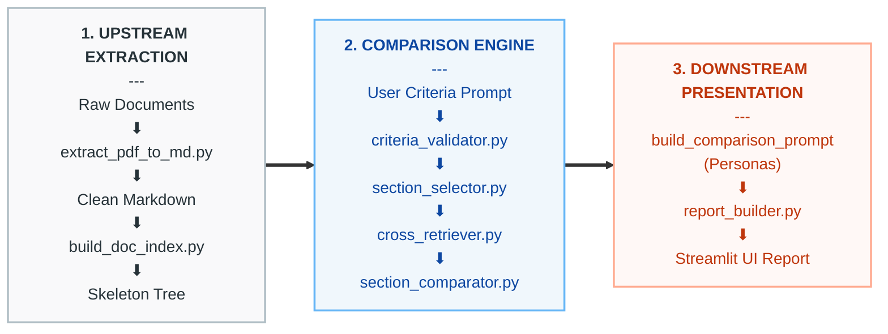

<p align="center">
  
</p>

# Proxy-Pointer DocComparator -- Versatile Cross-Document Comparison ⚖️

**DocComparator** — An extension of the Proxy-Pointer architecture that performs deep, section-by-section comparison across any two documents (from complex credit agreements to scientific research papers). Instead of simple keyword matching, it leverages Agentic RAG to untangle multi-layered trade-offs, identify missing clauses, and connect legal/academic text to real-world implications.

---

## How It Works

This diagram illustrates the modular, three-tier architecture of the versatile Document Comparator. The core comparison pipeline remains entirely decoupled from domain-specific rules, which are dynamically handled by the **Upstream Extraction** and **Downstream Reporting** layers.



### Architectural Tier Breakdown

#### 1. Upstream Extraction Layer
*   **Role**: Converts any incoming raw document structure into a standardized, machine-readable hierarchy.
*   **Programs Involved**:
    *   **`extract_pdf_to_md.py`**: Handles upstream ingestion, converting PDFs into clean, hierarchically formatted Markdown (bypassed if `.md` is directly uploaded).
    *   **`build_doc_index.py`**: Parses Markdown headers, filters administrative noise, and builds the hierarchical JSON structure map (`_structure.json`).

#### 2. Core Comparison Engine
*   **Role**: Coordinates semantic search over hierarchical document nodes.
*   **Programs Involved**:
    *   **`criteria_validator.py`**: Performs an initial feasibility check on the user's comparison criteria and dynamically detects the document type.
    *   **`section_selector.py`**: Implements Stage 1 PP Retrieval. It identifies and extracts the most relevant sections of Document 1 based on user criteria.
    *   **`cross_retriever.py`**: Implements Stage 2 PP Retrieval. It performs a targeted semantic search within Document 2's vector space using the context of the selected Document 1 sections.
    *   **`section_comparator.py`**: Coordinates pairwise evaluations of matching sections, passing them to the LLM to analyze alignments and discrepancies.

#### 3. Downstream Presentation Layer
*   **Role**: Tailors the analytical output to the target audience and formats the final visualization.
*   **Programs Involved**:
    *   **`build_comparison_prompt`**: Injects the appropriate analytical persona (e.g., Senior Academic Researcher with Shared-Foundation Dampening, or Senior Legal Counsel analyzing Risk-Direction).
    *   **`report_builder.py`**: Renders the final comparison report using professional scales and readable layouts, ready for markdown export.

---

## Architecture Deep Dive

For the full technical story behind the Proxy-Pointer architecture:

1. [Proxy-Pointer Framework for Structure-Aware Enterprise Document Intelligence](https://towardsdatascience.com/proxy-pointer-framework-for-structure-aware-enterprise-document-intelligence/) — Hierarchical understanding and comparison of contracts, research papers, and more
2. [Proxy-Pointer RAG: Structure Meets Scale — 100% Accuracy with Smarter Retrieval](https://towardsdatascience.com/proxy-pointer-rag-structure-meets-scale-100-accuracy-with-smarter-retrieval/) — Scaling to multi-document, LLM re-ranking, and benchmark results
3. [Proxy-Pointer RAG: Achieving Vectorless Accuracy at Vector RAG Scale and Cost](https://towardsdatascience.com/proxy-pointer-rag-achieving-vectorless-accuracy-at-vector-rag-scale-and-cost/) — Core architecture & the pointer-based retrieval idea

---

## 5-Minute Quickstart

### 1. Clone
```bash
git clone https://github.com/Proxy-Pointer/Proxy-Pointer-RAG.git
cd Proxy-Pointer-RAG
cd DocComparator
```

### 2. Create virtual environment
```bash
python -m venv venv
venv\Scripts\activate  # Windows
source venv/bin/activate  # macOS/Linux
```

### 3. Install dependencies
```bash
pip install -r requirements.txt
```

### 4. Configure API keys
```bash
cp .env.example .env
# Edit .env → add:
# 1. GOOGLE_API_KEY
# 2. LLAMA_CLOUD_API_KEY (For PDF extraction)
```

### 5. Start the UI
```bash
streamlit run app.py
```

### 6. Test with pre-loaded documents
Simply upload the `.md` or `.pdf` files from the `data/uploads/` directory directly into the UI. The system will automatically build the necessary indexes, trees, and markdown files on the first run. 
*   **Legal comparison**: Compare the `Emerson` and `TRoadhouse` credit agreements on criteria like "dispositions" or "representations and warranties".
*   **Academic comparison**: Compare `VectorFusion` and `VectorPainter` on criteria like "pipeline architecture" or "canvas initialization strategies".

### 7. Test Results
If you want to view the output reports without running the system yourself, you can look into the `results/` folder, which contains pre-generated artifact reports for the test cases mentioned above.

### 8. Bring Your Own Documents
You can upload and compare your own documents! However, please note:
*   **Upstream Adjustments**: The extraction script (`extract_pdf_to_md.py`) may need to be adjusted so that the generated markdown captures the proper section heading hierarchy of your specific documents. This is critical for accurate skeleton tree generation and downstream processing.
*   **Downstream Adjustments**: If your documents are not Legal Contracts or Academic Papers, the `build_comparison_prompt` function and `report_builder.py` may need adjustment to inject the proper persona, logic dampeners, and reporting format for your domain.

---

## Project Structure

```text
DocComparator/
├── src/
│   ├── comparison/
│   │   ├── cross_retriever.py    # Stage 2 PP Retrieval (Doc 2)
│   │   ├── section_comparator.py # Pairwise LLM evaluation engine
│   │   └── section_selector.py   # Stage 1 PP Retrieval (Doc 1)
│   ├── extraction/
│   │   └── extract_pdf_to_md.py  # LlamaParse PDF ingestion & formatting
│   ├── indexing/
│   │   └── build_doc_index.py    # Skeleton tree & FAISS vector builder
│   ├── report/
│   │   └── report_builder.py     # Markdown report generation logic
│   ├── validation/
│   │   └── criteria_validator.py # Persona injection & criteria feasibility
│   └── config.py                 # Core configurations and model definitions
├── data/                         # Unified Data Hub
│   └── uploads/                  # Raw PDFs and test documents
├── results/                      # Artifact reports for the test cases tried
└── app.py                        # Streamlit Comparator UI
```

---

## Configuration

All configuration is centralized in `src/config.py`. Override via environment variables:

| Variable                | Default             | Description                           |
| ----------------------- | ------------------- | ------------------------------------- |
| `GOOGLE_API_KEY`      | (required)          | Gemini API key                        |
| `LLAMA_CLOUD_API_KEY` | (required)          | LlamaParse API key for PDF extraction |
| `DC_UPLOADS_DIR`      | `data/uploads/`     | Uploads and raw testing files         |
| `DC_DOCUMENTS_DIR`    | `data/documents/`   | Processed Markdown source directory   |
| `DC_TREES_DIR`        | `data/trees/`       | Structure tree directory              |
| `DC_INDEX_DIR`        | `data/index/`       | FAISS index directory                 |

---

## Design Decisions

### Bypassing Surface-Level Keyword Matching
Instead of a simple keyword search, the Agentic pipeline performs deep, semantic contractual reasoning. It understands that the *absence* of a word ("safe harbor" or "projections") completely flips the legal risk profile for a borrower.

### Enterprise-Value Preservation
The tool bridges text to real-world business strategy. When analyzing credit agreements, it reveals how mature industrial giants (like Emerson) tolerate entirely different disposition covenants compared to highly regulated mid-market growth companies (like Texas Roadhouse).

### Auto-Detecting Modalities and Personas
The engine uses an LLM to evaluate the criteria and the document text. It dynamically detects whether the user is comparing legal contracts or academic research papers, and adjusts the prompt persona and logic dampeners (e.g. changing 🔴 Significant Discrepancy to 🟡 Moderate Difference when academic papers share similar underlying foundations).

---

## Feedback & Contact

- **GitHub Issues**: For bug reports.
- **General Questions**: For general questions, ideas, and enhancement requests, reach out to me on [LinkedIn](https://www.linkedin.com/in/partha-sarkar-lets-talk-ai) or [Email](mailto:partha.sarkarx@gmail.com).

---

## License

© 2026 Proxy-Pointer. Licensed under [MIT](../LICENSE).
