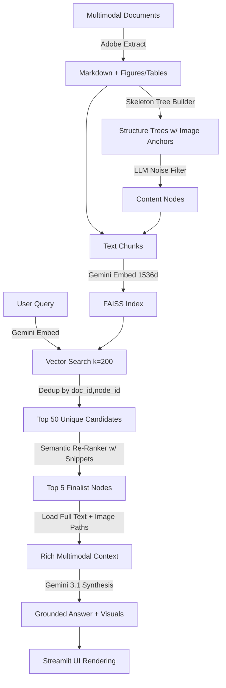

<p align="center">
  
</p>

# Proxy-Pointer MultiModal -- Answer with Visuals, not just text 🖼️

**MultiModal Retrieval without Multimodal Embeddings RAG Pipeline** — An extension of the Proxy-Pointer architecture that performs unified reasoning across text and graphics. It retrieves full document sections and automatically surfaces the associated figures, tables, and charts for multimodal synthesis.

---

## How It Works



Instead of retrieving small, context-less chunks, Proxy-Pointer MultiModal:

1. **Builds a structural tree** of each document, automatically mapping local image paths (figures/tables) to their specific parent sections.
2. **Filters noise** (TOC, abbreviations, etc.) using an LLM to ensure the re-ranker stays focused on technical content.
3. **Uses Semantic Snippets:** The re-ranker sees a 150-character preview of each section, allowing it to find technical topics (like "QK-Normalization") even if they aren't in the heading.
4. **Performs Anchor-Aware Retrieval:** If a query mentions "Figure 5" or "Table I", the system prioritizes sections that physically contain those anchors.
5. **Loads Full Multimodal Payloads:** The synthesizer sees the complete section text and the actual images paths, enabling high-fidelity "Visual Grounding."

---

## Architecture Deep Dive

Refer to [Proxy-Pointer RAG: Achieving Vectorless Accuracy at Vector RAG Scale and Cost](https://towardsdatascience.com/proxy-pointer-rag-achieving-vectorless-accuracy-at-vector-rag-scale-and-cost/) and [Proxy-Pointer RAG: Structure Meets Scale: 100% Accuracy with Smarter Retrieval](https://towardsdatascience.com/proxy-pointer-rag-structure-meets-scale-100-accuracy-with-smarter-retrieval/) for a detailed explanation of the architecture.

---

## 5-Minute Quickstart

A sample dataset containing five complex research papers (**CLIP, GaLore, NemoBot, VectorFusion, and VectorPainter**) is included. You just need to build the index and start querying.

### 1. Clone
```bash
git clone https://github.com/Proxy-Pointer/Proxy-Pointer-RAG.git
cd Proxy-Pointer-RAG
cd MultiModal
```

### 2. Create virtual environment
```bash
python -m venv venv
venv\Scripts\activate  # Windows
source venv/bin/activate  # macOS/Linux
```

### 3. Install dependencies
```bash
pip install -r requirements.txt
```

### 4. Configure API keys
```bash
cp .env.example .env
# Edit .env → add:
# 1. GOOGLE_API_KEY

```

### 5. Build the index
```bash
# This builds the FAISS index and structure trees for all 5 papers
python -m src.indexing.build_md_index --fresh
```

### 6. Start the UI
```bash
streamlit run app.py
```
Try a query like:

```
User >> Tell me about the VectorPainter pipeline
or a more advanced comparative one:
User >> Compare GaLore's approach to memory efficiency with the standard Low-Rank Adaptation (LoRA) mentioned in generative model fine-tuning.
```

---

## Running Benchmarks

The MultiModal version includes an automated evaluation script that runs a 20-query technical suite across all 5 papers.

```bash
# Run the technical evaluation
python run_test_suite.py
```

---

## Benchmark Results (20 Queries · 5 Papers · 0 Failures)

| Q | Paper(s) | Category | Text | Images | Score | Reason |
|---|----------|----------|:----:|:------:|------:|--------|
| 1 | Galore | Precise Data | 🟢 | 🟢 | 100% | Exact hyperparams extracted; Table 7 surfaced |
| 2 | VectorPainter | Precise Data | 🟢 | 🟢 | 100% | Stroke extraction + baseline comparison; pipeline + human eval table |
| 3 | Galore | Precise Data | 🟢 | 🟢 | 100% | Exact perplexity values (15.56 / 15.64 / 19.21); Table 2 retrieved |
| 4 | CLIP | Precise Data | 🟢 | 🟢 | 100% | Exact HM scores (81.06 / 78.55 / 71.66); Table 1 retrieved |
| 5 | VectorFusion | Visual | 🟢 | 🟢 | 100% | All 3 pipeline stages described; Figure 3 + Figure 5 retrieved |
| 6 | CLIP | Visual | 🟢 | 🟢 | 100% | All 3 loss components correct; Figure 2 framework diagram retrieved |
| 7 | NemoBot | Visual | 🟢 | 🟢 | 100% | System flow + UI described; Figure 3 + Figure 4 retrieved |
| 8 | VectorFusion | Visual | 🟢 | 🟢 | 100% | Exact CLIP R-Precision scores; Table 1 comparison retrieved |
| 9 | NemoBot | Visual | 🟢 | 🔴 | 75% | Michie's algorithm correctly explained; no images retrieved (relevant images were in a sub-section that missed the Top-5 node cutoff) |
| 10 | Galore | Structural | 🟢 | 🟢 | 100% | LLaMA 7B results + memory breakdown; Table 3 + Table 1 retrieved |
| 11 | VectorPainter | Structural | 🟢 | 🟢 | 95% | Pipeline explained; honestly states "Vector Dropout not found"; Figure 3 + Figure 4 |
| 12 | CLIP | Structural | 🟢 | 🟢 | 100% | KL divergence formula correct; Figure 5 equation image retrieved |
| 13 | VectorFusion | Complex | 🟢 | 🟢 | 100% | Latent SDS loss formulation with full equation; Figure 5 SDS diagram retrieved |
| 14 | NemoBot | Complex | 🟢 | 🟢 | 100% | All 3 Shannon categories with game examples; Table I + 5 supporting figures |
| 15 | CLIP + VF | Cross-Doc | 🟢 | 🟡 | 90% | CLIP metrics compared, but retriever confused CLIP-CITE paper with VectorPainter's CLIP metrics section |
| 16 | Galore + CLIP | Cross-Doc | 🟢 | 🟢 | 100% | Gradient projection vs fine-tuning contrasted; GaLore Table 1 + CLIP Table 5 |
| 17 | VP + VF | Cross-Doc | 🟢 | 🟡 | 90% | Diffusion + SVG strategies contrasted; VectorPainter pipeline retrieved but missed VectorFusion pipeline (LLM selection variance) |
| 18 | NemoBot | Anchor-Aware | 🟢 | 🟢 | 100% | All games listed with Shannon categories; Table I + 5 supporting figures |
| 19 | VectorFusion | Anchor-Aware | 🟢 | 🟢 | 100% | Bezier path effects correctly described; Figure 9 ablation chart retrieved |
| 20 | NemoBot + Galore | Cross-Doc | 🟢 | 🟢 | 100% | LLM interaction vs memory efficiency contrasted; Figure 3 + Table 1 |

> **20 / 20 text responses correct · 17 / 20 image retrievals perfect · Weighted average: 96%**

Full results are available in `results/test_log.json`.

---

## Adding Your Own Documents

### Option A: You already have processed folders
If you have folders containing `.md` files and associated images (e.g., from a previous extraction):
1. Place the folders inside `data/extracted_papers/`.
2. Run the indexer to process the new text and anchors:
   ```bash
   python -m src.indexing.build_md_index
   ```

### Option B: Start from PDFs
1. Add your `ADOBE_CLIENT_ID` and `ADOBE_CLIENT_SECRET` to your `.env` file.
2. Place your raw PDFs in `data/pdf/`.
3. Extract to vision-ready Markdown and Figures:
   ```bash
   # This uses Adobe Extract PDF API to generate MD + Image assets
   python -m src.extraction.extract_pdf
   ```
4. Build the index:
   ```bash
   python -m src.indexing.build_md_index
   ```

---

## Project Structure

```
MultiModal/
├── src/
│   ├── config.py             # Model selection (Gemini 3.1 Flash Lite)
│   ├── agent/
│   │   └── mm_rag_bot.py     # MultiModal RAG Logic
│   ├── indexing/
│   │   ├── md_tree_builder.py # Structure Tree generator
│   │   └── build_md_index.py  # Vector index builder
│   └── extraction/
│       └── extract_pdf.py     # Adobe pdf Extraction to MD logic
├── data/                      # Unified Data Hub
│   ├── extracted_papers/      # Processed Markdown & Figures
│   └── pdf/                   # Original Source PDFs
├── results/                   # Benchmarking Hub
│   ├── test_log.json          # 20-query results & metrics
│   └── test_queries.json      # Benchmark questions
├── app.py                     # Streamlit Multimodal UI
└── run_test_suite.py          # Automated benchmark runner
```

---

## Configuration

All configuration is centralized in `src/config.py`. Override via environment variables:

| Variable                | Default             | Description                           |
| ----------------------- | ------------------- | ------------------------------------- |
| `GOOGLE_API_KEY`      | (required)          | Gemini API key                        |
| `ADOBE_CLIENT_ID`     | (required)          | Adobe PDF Services ID for extraction  |
| `ADOBE_CLIENT_SECRET` | (required)          | Adobe PDF Services Secret             |
| `PP_DATA_DIR`         | `data/extracted_papers/` | Markdown source directory             |
| `PP_TREES_DIR`        | `data/trees/`       | Structure tree directory              |
| `PP_INDEX_DIR`        | `data/index/`       | FAISS index directory                 |
| `PP_RESULTS_DIR`      | `results/`          | Benchmark results directory           |

---

## Design Decisions

### Why Semantic Snippets?
Standard vector RAG returns chunks by embedding similarity. However, technical deep-dives (like "gradient projection" in the GaLore paper) are often buried in sections with generic headers like "Memory-Efficient Training". By giving the re-ranker a **Semantic Snippet** (first 150 chars), the LLM can identify the technical answer even when the header is unhelpful.

### Why Anchor-Aware Re-ranking?
Users often ask about specific "ghost anchors" (e.g., "What does Table 1 show?"). Since multiple papers might have a "Table 1," the re-ranker performs a structural sweep of all candidates to find the specific section that physically contains the anchor mentioned in the query.

### Why Full-Section Loading?
The indexed chunk is just a fragment. The synthesizer needs the **complete** section (including headers, full tables, and every associated image) for accurate multimodal synthesis. The chunk acts as a **pointer**; the full section + its images is the **payload**.

---
## Feedback & Contact

- **GitHub Issues**: For bug reports.
- **General Questions**: For general questions, ideas, and enhancement requests, reach out to me on [LinkedIn](https://www.linkedin.com/in/partha-sarkar-lets-talk-ai) or [Email](mailto:partha.sarkarx@gmail.com).


---

## License

© 2026 Proxy-Pointer. Licensed under [MIT](../LICENSE).
