# GaLore: Memory-Efficient LLM Training by Gradient Low-Rank Projection

arXiv:2403.03507v2  [cs.LG]  2 Jun 2024

Jiawei Zhao 1 Zhenyu Zhang 3 Beidi Chen 2 4 Zhangyang Wang 3 Anima Anandkumar * 1 Yuandong Tian * 2

# Abstract

Training Large Language Models (LLMs) presents significant memory challenges, predominantly due to the growing size of weights and optimizer states. Common memory-reduction approaches, such as low-rank adaptation (LoRA), add a trainable low-rank matrix to the frozen pre-trained weight in each layer. However, such approaches typically underperform training with full-rank weights in both pre-training and fine-tuning stages since they limit the parameter search to a low-rank subspace and alter the training dynamics, and further, may require full-rank warm start. In this work, we propose Gradient Low-Rank Projection (GaLore), a training strategy that allows full-parameter learning but is more memory-efficient than common low-rank adaptation methods such as LoRA. Our approach reduces memory usage by up to 65.5% in optimizer states while maintaining both efficiency and performance for pre-training on LLaMA 1B and 7B architectures with C4 dataset with up to 19.7B tokens, and on fine-tuning RoBERTa on GLUE tasks. Our 8-bit GaLore further reduces optimizer memory by up to 82.5% and total training memory by 63.3%, compared to a BF16 baseline. Notably, we demonstrate, for the first time, the feasibility of pre-training a 7B model on consumer GPUs with 24GB memory (e.g., NVIDIA RTX 4090) without model parallel, checkpointing, or offloading strategies. Code is provided in the (<https://github.com/jiaweizzhao/GaLore>)link.

# 1. Introduction

Large Language Models (LLMs) have shown impressive performance across multiple disciplines, including conversational AI and language translation. However, pre-training

*Equal advising
1California Institute of Technology
2Meta AI
3University of Texas at Austin
4Carnegie Mellon University. Cor-respondence to: Jiawei Zhao <jiawei@caltech.edu>, Yuandong Tian <yuandong@meta.com>.
Proceedings of the 41 st International Conference on Machine Learning, Vienna, Austria. PMLR 235, 2024. Copyright 2024 by the author(s).

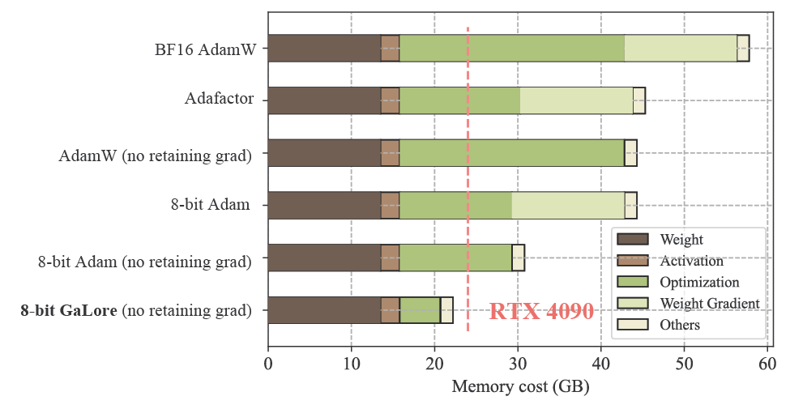

BF16 AdamW Adafactor 8-bit Adam 8-bit GaLore (no retaining grad) AdamW (no retaining grad) 8-bit Adam (no retaining grad) RTX 4090

Figure 1: Estimated memory consumption of pre-training a LLaMA 7B model with a token batch size of 256 on a single device, without activation checkpointing and memory offloading2 . Details refer to Section 5.5.

Algorithm 1: GaLore, PyTorch-like

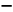

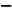

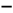

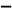

for weight in model.parameters(): grad = weight.grad # original space -> compact space lor grad = project(grad) # update by Adam, Adafactor, etc. lor update = update(lor grad) # compact space -> original space update = project back(lor update) weight.data += update

and fine-tuning LLMs require not only a huge amount of computation but is also memory intensive. The memory requirements include not only billions of trainable parameters, but also their gradients and optimizer states (e.g., gradient momentum and variance in Adam) that can be larger than parameter storage themselves (Raffel et al., 2020; Touvron et al., 2023; Chowdhery et al., 2023). For example, pre-training a LLaMA 7B model from scratch with a single batch size requires at least 58 GB memory (14GB for trainable parameters, 42GB for Adam optimizer states and weight gradients, and 2GB for activations1). This makes the training not feasible on consumer-level GPUs such as NVIDIA RTX 4090 with 24GB memory.

In addition to engineering and system efforts, such as gradient checkpointing (Chen et al., 2016), memory offload-

1The calculation is based on LLaMA architecture, BF16 numerical format, and maximum sequence length of 2048.
2In the figure, “no retaining grad” denotes the application of per-layer weight update to reduce memory consumption of storing weight gradient (Lv et al., 2023b).

ing (Rajbhandari et al., 2020), etc., to achieve faster and more efficient distributed training, researchers also seek to develop various optimization techniques to reduce the memory usage during pre-training and fine-tuning.

Parameter-efficient fine-tuning (PEFT) techniques allow for the efficient adaptation of pre-trained language models (PLMs) to different downstream applications without the need to fine-tune all of the model’s parameters (Ding et al., 2022). Among them, the popular Low-Rank Adaptation (LoRA Hu et al. (2022)) reparameterizes weight matrix W ∈ Rm×n into W = W0 + BA, where W0 is a frozen full-rank matrix and B ∈ Rm×r , A ∈ Rr×n are additive low-rank adaptors to be learned. Since the rank r ≪ min(m, n), A and B contain fewer number of trainable parameters and thus smaller optimizer states. LoRA has been used extensively to reduce memory usage for fine-tuning in which W0 is the frozen pre-trained weight. Its variant ReLoRA is also used in pre-training, by periodically updating W0 using previously learned low-rank adap-tors (Lialin et al., 2024).

However, many recent works demonstrate the limitation of such a low-rank reparameterization. For fine-tuning, LoRA is not shown to reach a comparable performance as full-rank fine-tuning (Xia et al., 2024). For pre-training from scratch, it is shown to require a full-rank model training as a warmup (Lialin et al., 2024), before optimizing in the low-rank subspace. There are two possible reasons: (1) the optimal weight matrices may not be low-rank, and (2) the reparameterization changes the gradient training dynamics.

Our approach: To address the above challenge, we propose Gradient Low-Rank Projection (GaLore), a training strategy that allows full-parameter learning but is more memory-efficient than common low-rank adaptation methods, such as LoRA. Our key idea is to leverage the slow-changing low-rank structure of the gradient G ∈ Rm×n of the weight matrix W , rather than trying to approximate the weight matrix itself as low rank.

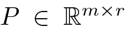

P ∈ Rm×r

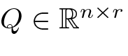

n×r

Q ∈ R

We first show theoretically that the gradient matrix G becomes low-rank during training. Then, we propose Ga-Lore that computes two projection matrices and to project the gradient matrix G into a low-rank form P ⊤GQ. In this case, the memory cost of optimizer states, which rely on component-wise gradient statistics, can be substantially reduced. Occasional updates of P and Q (e.g., every 200 iterations) incur minimal amortized additional computational cost. GaLore is more memory-efficient than LoRA as shown in Table 1. In practice, this yields up to 30% memory reduction compared to LoRA during pre-training.

We demonstrate that GaLore works well in both LLM pre-training and fine-tuning. When pre-training LLaMA 7B on

C4 dataset, 8-bit GaLore, combined with 8-bit optimizers and layer-wise weight updates techniques, achieves comparable performance to its full-rank counterpart, with less than 10% memory cost of optimizer states.

Notably, for pre-training, GaLore keeps low memory throughout the entire training, without requiring full-rank training warmup like ReLoRA. Thanks to GaLore’s memory efficiency, it is possible to train LLaMA 7B from scratch on a single GPU with 24GB memory (e.g., on NVIDIA RTX 4090), without any costly memory offloading techniques (Fig. 1).

GaLore is also used to fine-tune pre-trained LLMs on GLUE benchmarks with comparable or better results than existing low-rank methods. When fine-tuning RoBERTa-Base on GLUE tasks with a rank of 4, GaLore achieves an average score of 85.89, outperforming LoRA, which achieves a score of 85.61.

As a gradient projection method, GaLore is independent of the choice of optimizers and can be easily plugged into existing ones with only two lines of code, as shown in Algorithm 1. Our experiment (Fig. 3) shows that it works for popular optimizers such as AdamW, 8-bit Adam, and Adafactor. In addition, its performance is insensitive to very few hyper-parameters it introduces. We also provide theoretical justification on the low-rankness of gradient update, as well as the convergence analysis of GaLore.

# 2. Related Works

Low-rank adaptation. Hu et al. (2022) proposed Low-Rank Adaptation (LoRA) to fine-tune pre-trained models with low-rank adaptors. This method reduces the memory footprint by maintaining a low-rank weight adaptor for each layer. There are a few variants of LoRA proposed to enhance its performance (Renduchintala et al., 2023; Sheng et al., 2023; Zhang et al., 2023; Xia et al., 2024), supporting multi-task learning (Wang et al., 2023b), and further reducing the memory footprint (Dettmers et al., 2024). Lialin et al. (2024) proposed ReLoRA, a variant of LoRA designed for pre-training, but requires a full-rank training warmup to achieve comparable performance as the standard baseline. Inspired by LoRA, Hao et al. (2024) also suggested that gradients can be compressed in a low-rank subspace, and they proposed to use random projections to compress the gradients. There have also been approaches that propose training networks with low-rank factorized weights from scratch (Kamalakara et al., 2022; Wang et al., 2023a; Zhao et al., 2023).

Subspace learning. Recent studies have demonstrated that the learning primarily occurs within a significantly low-dimensional parameter subspace (Gur-Ari et al., 2018;

Larsen et al., 2022). These findings promote a special type of learning called subspace learning, where the model weights are optimized within a low-rank subspace. This notion has been widely used in different domains of machine learning, including meta-learning and continual learning (Lee & Choi, 2018; Chaudhry et al., 2020).

Projected gradient descent. GaLore is closely related to the traditional topic of projected gradient descent (PGD) (Chen & Wainwright, 2015; Chen et al., 2019). A key difference is that, GaLore considers the specific gradient form that naturally appears in training multi-layer neural networks (e.g., it is a matrix with specific structures), proving many of its properties (e.g., Lemma 3.3, Theorem 3.2, and Theorem 3.8). In contrast, traditional PGD mostly treats the objective as a general blackbox nonlinear function, and study the gradients in the vector space only.

Low-rank gradient. Gradient is naturally low-rank during training of neural networks, and this property have been studied in both theory and practice (Zhao et al., 2022; Cos-son et al., 2023; Yang et al., 2023). It has been applied to reduce communication cost (Wang et al., 2018; Vogels et al., 2020), and memory footprint during training (Goon-eratne et al., 2020; Huang et al., 2023; Modoranu et al., 2023).

Memory-efficient optimization. There have been some works trying to reduce the memory cost of gradient statistics for adaptive optimization algorithms (Shazeer & Stern, 2018; Anil et al., 2019; Dettmers et al., 2022). Quantization is widely used to reduce the memory cost of optimizer states (Dettmers et al., 2022; Li et al., 2024). Recent works have also proposed to reduce weight gradient memory by fusing the backward operation with the optimizer update (Lv et al., 2023a;b).

# 3. GaLore: Gradient Low-Rank Projection

## 3.1. Background

Regular full-rank training. At time step t, Gt = −∇W φt(Wt) ∈ Rm×n is the backpropagated (negative) gradient matrix. Then the regular pre-training weight update can be written down as follows (η is the learning rate): where G˜ t is the final processed gradient to be added to the weight matrix and ρt is an entry-wise stateful gradient regularizer (e.g., Adam). The state of ρt can be memory-intensive. For example, for Adam, we need M, V ∈ Rm×n

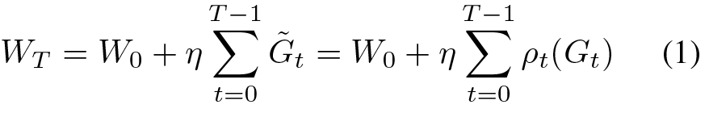

WT = W0 + η T −1 t=0 ˜Gt = W0 + η T −1 t=0 ρt(Gt) (1)

to regularize the gradient Gt into G˜ t:

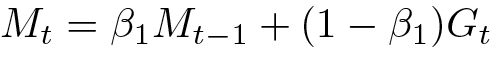

Mt = β1Mt−1 + (1 − β1)Gt

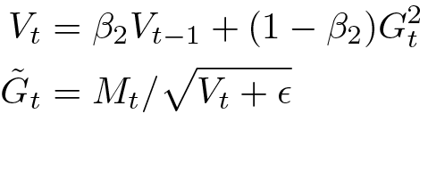

Vt = β2Vt−1 + (1 − β2)G 2 t ˜Gt = Mt/  Vt +ϵ

(2)

(3)

(4)

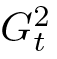

2

t

G

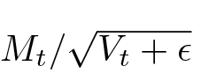

t

t

M/ √ V+ ϵ

Here and means element-wise multiplication and division. η is the learning rate. Together with W ∈ Rm×n , this takes 3mn memory.

Low-rank updates. For a linear layer W ∈ Rm×n , LoRA and its variants utilize the low-rank structure of the update matrix by introducing a low-rank adaptor AB:

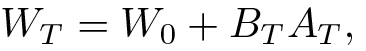

WT = W0 + BT AT ,

(5)

where B ∈ Rm×r and A ∈ Rr×n , and r ≪ min(m, n). A and B are the learnable low-rank adaptors and W0 is a fixed weight matrix (e.g., pre-trained weight).

## 3.2. Low-Rank Property of Weight Gradient

While low-rank updates are proposed to reduce memory usage, it remains an open question whether the weight matrix should be parameterized as low-rank. In many situations, this may not be true. For example, in linear regression y = W x, if the optimal W ∗ is high-rank, then imposing a low-rank assumption on W never leads to the optimal solution, regardless of what optimizers are used.

Surprisingly, while the weight matrices are not necessarily low-rank, the gradient indeed becomes low-rank during the training for certain gradient forms and associated network architectures.

Reversible networks. Obviously, for a general loss function, its gradient can be arbitrary and is not necessarily low rank. Here we study the gradient structure for a general family of nonlinear networks known as “reversible networks” (Tian et al., 2020), which includes not only simple linear networks but also deep ReLU/polynomial networks:

Definition 3.1 (Reversiblity (Tian et al., 2020)). A network N that maps input x to output y = N (x) is reversible, if there exists L(x; W ) so that y = L(x; W )x, and the backpropagated gradient gx satisfies gx = L⊤(x; W )gy, where gy is the backpropagated gradient at the output y. Here L(x; W ) depends on the input x and weight W in the network N .

Please check Appendix B.1 for its properties. For reversible networks, the gradient takes a specific form.

Theorem 3.2 (Gradient Form of reversible models). Consider a chained reversible neural network N (x) := NL(NL−1(. . . N1(x))) and define Jl := Jacobian(NL) . . . Jacobian(Nl+1) and

fl := Nl(. . . N1(x)). Then the weight matrix Wl at layer l has gradient Gl in the following form for batch size 1:

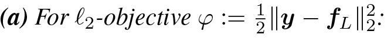

(a) For ℓ2-objective φ := 1 2 ∥y − fL∥2 2:

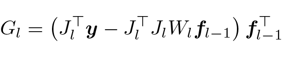

Gl =  J ⊤ l y −J ⊤ l JlWlfl−1  f ⊤ l−1

(6)

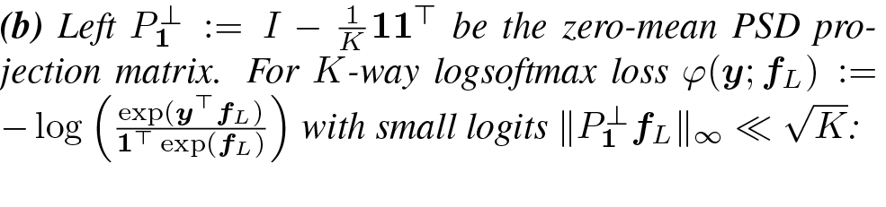

(b) Left P ⊥ 1 := I − 1 Kexp(y exp(fL) 11⊤ be the zero-mean PSD pro-jectionmatrix. For K-way logsoftmax loss φ(y; fL) := − log  ⊤fL) 1⊤  with small logits ∥P⊥ 1 fL∥∞ ≪ √K:

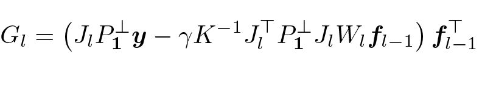

Gl =  JlP ⊥ 1y − γK−1 J ⊤ l P ⊥ 1 JlWlfl−1  f ⊤ l−1

(7)

where γ ≈ 1 and y is a data label with y⊤1 = 1.

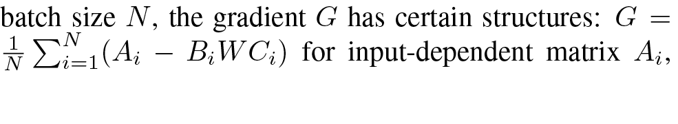

1

N

i

i

i

i

batch size N, the gradient G has certain structures: G = N i=1(A− BWC) for input-dependent matrix A,

From the theoretical analysis above, we can see that for Positive Semi-definite (PSD) matrices Bi and Ci. In the following, we prove that such a gradient will become low-rank during training in certain conditions:

Lemma 3.3 (Gradient becomes low-rank during training). Suppose the gradient follows the parametric form:

Gt = 1N N i=1 (Ai − BiWtCi)

(8)

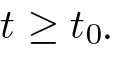

0

t ≥ t.

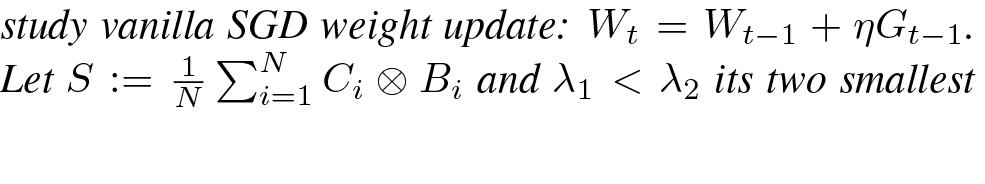

t

t−1

t−1

1

N

N

i=1

i

i

1

2

study vanilla SGD weight update: W= W+ ηG. Let S :=  C⊗ Band λ< λits two smallest

with constant Ai, PSD matrices Bi and Ci after We distinct eigenvalues. Then the stable rank sr(Gt) satisfies:

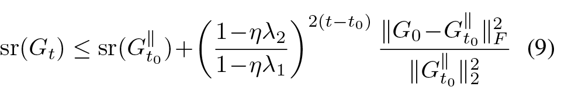

sr(Gt) ≤ sr(G ∥ t0 )+  1−ηλ2 1−ηλ1  2(t−t0) ∥G0 −G ∥ t0 ∥2 F ∥G ∥ t0 ∥2 2 (9)

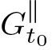

∥

t0

G

where is the projection of Gt0 onto the minimal eigenspace V1 of S corresponding to λ1.

In practice, the constant assumption can approximately hold for some time, in which the second term in Eq. 9 goes to zero exponentially and the stable rank of Gt goes down, yielding low-rank gradient Gt. The final stable rank is determined by sr(Gt∥0 ), which is estimated to be low-rank by the following:

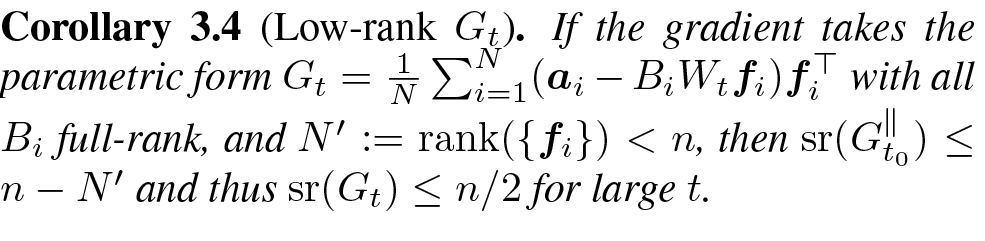

Corollary 3.4 (Low-rank Gt). If the gradient takes the parametric form Gt = 1 N Ni=1(ai − BiWtfi)f⊤ iwith all Bi full-rank, and N ′ := rank({fi}) < n, then sr(G∥t0 ) ≤ n − N ′ and thus sr(Gt) ≤ n/2 for large t.

Remarks. The gradient form is justified by Theorem 3.2. Intuitively, when N ′ is small, Gt is a summation of N ′ rank-1 update and is naturally low rank; on the other hand, when N ′ becomes larger and closer to n, then the training

dynamics has smaller null space V1, which also makes Gt low-rank. The full-rank assumption of {Bi} is reasonable, e.g., in LLMs, the output dimensions of the networks (i.e., the vocabulary size) is often huge compared to matrix dimensions.

In general if the batch size N is large, then it becomes a bit tricky to characterize the minimal eigenspace V1 of S. On the other hand, if V1 has nice structure, then sr(Gt) can be bounded even further:

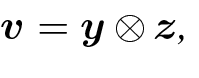

v = y ⊗ z,

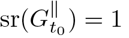

∥

t0

sr(G) = 1

Corollary 3.5 (Low-rank Gt with special structure of V1). If V1(S) is 1-dimensional with decomposable eigenvector then and thus Gt becomes rank-1.

One rare failure case of Lemma 3.3 is when Gt∥0 is precisely zero, in which sr(Gt∥0 ) becomes undefined. This happens to be true if t0 = 0, i.e., Ai, Bi and Ci are constant throughout the entire training process. Fortunately, for practical training, this does not happen.

Transformers. For Transformers, we can also separately prove that the weight gradient of the lower layer (i.e., project-up) weight of feed forward network (FFN) becomes low rank over time, using the JoMA framework (Tian et al., 2024). Please check Appendix (Sec. B.3) for details.

## 3.3. Gradient Low-rank Projection (GaLore)

Since the gradient G may have a low-rank structure, if we can keep the gradient statistics of a small “core” of gradient G in optimizer states, rather than G itself, then the memory consumption can be reduced substantially. This leads to our proposed GaLore strategy:

Definition 3.6 (Gradient Low-rank Projection (GaLore)). Gradient low-rank projection (GaLore) denotes the following gradient update rules (η is the learning rate):

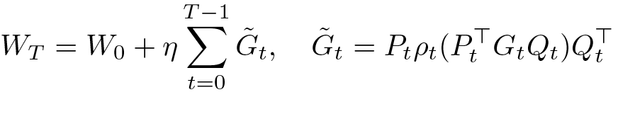

WT = W0 + η T −1 t=0 ˜Gt, ˜Gt = Ptρt(P ⊤ t GtQt)Q ⊤ t

(10)

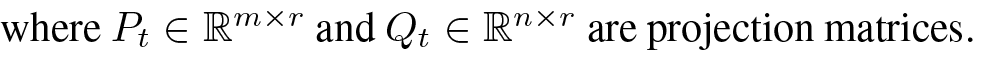

where Pt ∈Rm×r and Qt ∈Rn×r are projection matrices.

Different from LoRA, GaLore explicitly utilizes the low-rank updates instead of introducing additional low-rank adaptors and hence does not alter the training dynamics.

In the following, we show that GaLore converges under a similar (but more general) form of gradient update rule (Eqn. 8). This form corresponds to Eqn. 6 but with a larger batch size.

Definition 3.7 (L-continuity). A function h(W) has (Lipschitz) L-continuity, if for any W1 and W2, ∥h(W1) − h(W2)∥F ≤ L∥W1 − W2∥F .

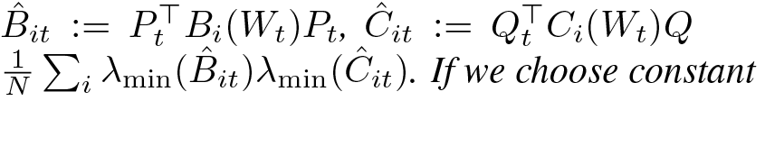

ˆB

it

⊤

t

i

t

t

it

⊤ t

i

N

t

1

i

min

it

min

it

:= P B(W)P,ˆC:=QC(W)Q λ(ˆB)λ(ˆC). Ifwechoose constant

Theorem 3.8 (Convergence of GaLore with tions). Suppose the gradient has the form of Ai, Bi and Ci have LA, LB and LC continuity spect to W and ∥Wt∥ ≤ D. Let Rt := and Qt = Q, then GaLore with ρt ≡ 1 satisfies:

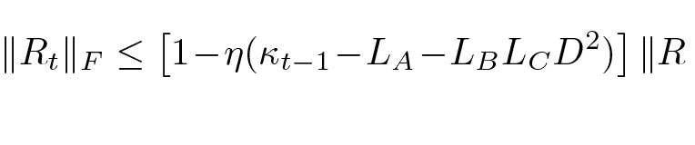

∥Rt∥F ≤  1−η(κt−1 −LA −LBLC D2)  ∥R

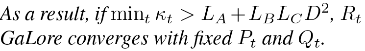

As a result, if mint κt > LA +LBLC D2 , Rt GaLore converges with fixed Pt and Qt.

Setting P and Q. The theorem tells that P and project into the subspaces corresponding to largest eigenvectors of Bˆ it and Cˆ it for faster convergence (large κt). While all eigenvalues of the positive semidefinite (PSD) matrix B and C are non-negative, some of them can be very small and hinder convergence (i.e., it takes a long time for Gt to become 0). With the projection P and Q, P ⊤BitP and Q⊤CitQ only contain the largest eigen subspaces of B and C, improving the convergence of Rt and at the same time, reduces the memory usage.

While it is tricky to obtain the eigenstructure of Bˆ it and Cˆit (they are parts of Jacobian), one way is to instead use the spectrum of Gt via Singular Value Decomposition (SVD):

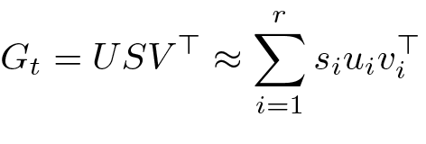

Gt = USV ⊤ ≈ r i=1 siuiv ⊤ i

(12)

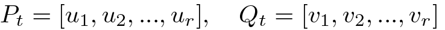

Pt = [u1, u2, ..., ur], Qt = [v1, v2, ..., vr]

(13)

Difference between GaLore and LoRA. While both Ga-Lore and LoRA have “low-rank” in their names, they follow very different training trajectories. For example, when r = min(m, n), GaLore with ρt ≡ 1 follows the exact training trajectory of the original model, as G˜ t = PtPt⊤GtQtQt⊤ = Gt. On the other hand, when BA reaches full rank (i.e., B ∈ Rm×m and A ∈ Rm×n), optimizing B and A simultaneously follows a very different training trajectory compared to the original model.

# 4. GaLore for Memory-Efficient Training

For a complex optimization problem such as LLM pre-training, it may be difficult to capture the entire gradient trajectory with a single low-rank subspace. One reason is that the principal subspaces of Bt and Ct (and thus Gt) may change over time. In fact, if we keep the same projection P and Q, then the learned weights will only grow along these subspaces, which is not longer full-parameter training. Fortunately, for this, GaLore can switch subspaces during training and learn full-rank weights without increasing the memory footprint.

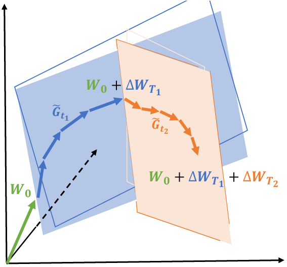

𝑾𝟎 𝑾𝟎 + ∆𝑾𝑻𝟏 𝑾𝟎 + ∆𝑾𝑻𝟏 + ∆𝑾𝑻𝟐 𝑮𝒕𝟏 𝑮𝒕𝟐

Figure 2: Learning through low-rank subspaces ∆WT1 and ∆WT2 using GaLore. For t1 ∈ [0, T1 − 1], W are updated by projected gradients G˜ t1 in a subspace determined by fixed Pt1 and Qt1 . After T1 steps, the subspace is changed by recomputing Pt2 and Qt2 for t2 ∈ [T1, T2 − 1], and the process repeats until convergence.

## 4.1. Composition of Low-Rank Subspaces

We allow GaLore to switch across low-rank subspaces:

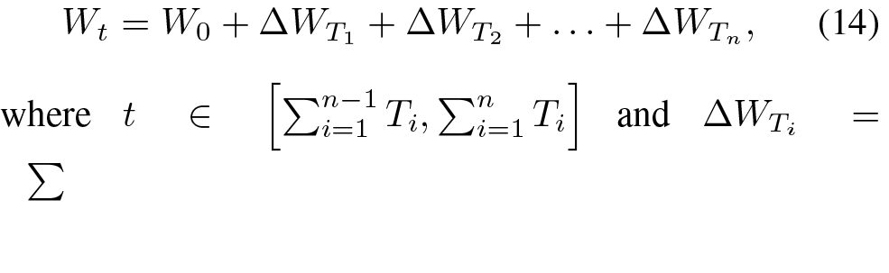

Wt = W0 + ∆WT1 + ∆WT2 +. . . + ∆WTn , (14) where t ∈  n−1 i=1 Ti,  n i=1 Ti  and ∆WTi = 

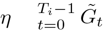

Ti−1

t=0

t

η ˜G

is the summation of all Ti updates within the i-th subspace. When switching to i-th subspace at step t = Ti, we re-initialize the projector Pt and Qt by performing SVD on the current gradient Gt by Equation 12. We illustrate how the trajectory of G˜t traverses through multiple low-rank subspaces in Fig. 2. In the experiment section, we show that allowing multiple low-rank subspaces is the key to achieving the successful pre-training of LLMs.

Following the above procedure, the switching frequency T becomes a hyperparameter. The ablation study (Fig. 5) shows a sweet spot exists. A very frequent subspace change increases the overhead (since new Pt and Qt need to be computed) and breaks the condition of constant projection in Theorem 3.8. In practice, it may also impact the fidelity of the optimizer states, which accumulate over multiple training steps. On the other hand, a less frequent change may make the algorithm stuck into a region that is no longer important to optimize (convergence proof in Theorem 3.8 only means good progress in the designated subspace, but does not mean good overall performance). While optimal T depends on the total training iterations and task complexity, we find that a value between T = 50 to T = 1000 makes no much difference. Thus, the total computational overhead induced by SVD is negligible (< 10%) compared to other memory-efficient training techniques such as memory offloading (Rajbhandari et al., 2020).

## 4.2. Memory-Efficient Optimization

Reducing memory footprint of gradient statistics. Ga-

Algorithm 2: Adam with GaLore

Input: A layer weight matrix W ∈ Rm×n with m ≤ n. Step size η, scale factor α, decay rates β1, β2, rank r, subspace change frequency T.

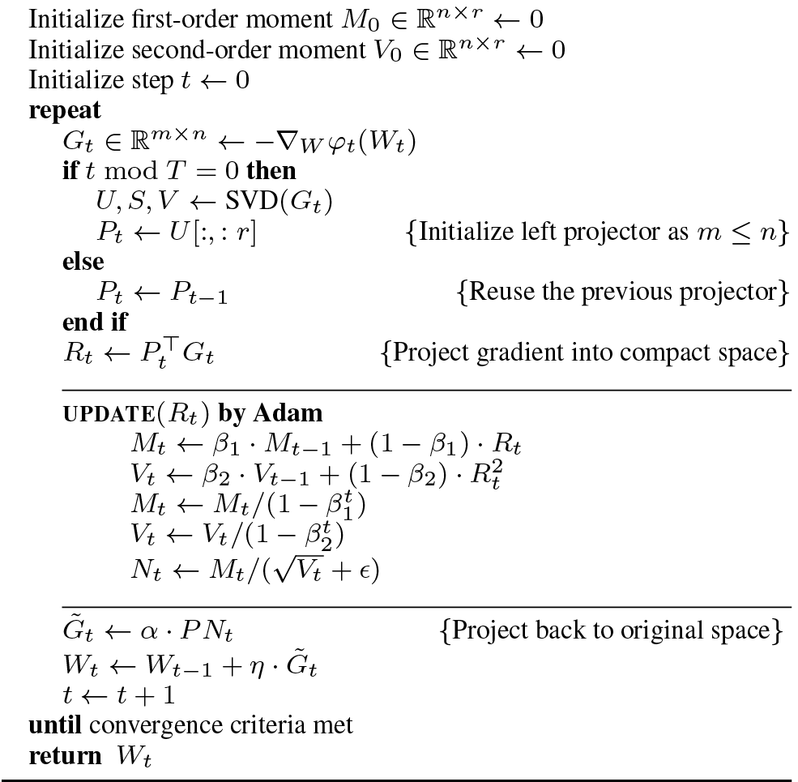

Initialize first-order moment M0 ∈ Rn×r ←0 Initialize second-order moment V0 ∈ Rn×r ←0 Initialize step t ← 0 repeat Gt ∈ Rm×n ← −∇W φt(Wt) if t mod T = 0 then U, S, V ← SVD(Gt) Pt ← U[:, : r] {Initialize left projector as m ≤ n} else Pt ← Pt−1 {Reuse the previous projector} end if Rt ← P ⊤ t Gt {Project gradient into compact space} UPDATE(Rt) by Adam Mt ← β1 · Mt−1 + (1 − β1) · Rt Vt ← β2 · Vt−1 + (1 − β2) · R2 t Mt ← Mt/(1 − βt 1) Vt ← Vt/(1 − βt 2) Nt ← Mt/( √ Vt + ϵ) ˜Gt ← α · P Nt {Project back to original space} Wt ← Wt−1 + η · Gt ˜ t ← t+1 until convergence criteria met return Wt

Lore significantly reduces the memory cost of optimizer that heavily rely on component-wise gradient statistics, such as Adam (Kingma & Ba, 2015). When ρt ≡ Adam, by projecting Gt into its low-rank form Rt, Adam’s gradient regularizer ρt(Rt) only needs to track low-rank gradient statistics. where Mt and Vt are the first-order and second-order momentum, respectively. GaLore computes the low-rank normalized gradient Nt as follows:

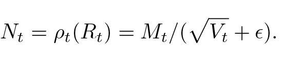

Nt = ρt(Rt) = Mt/(  Vt + ϵ).

(15)

GaLore can also apply to other optimizers (e.g., Adafactor) that have similar update rules and require a large amount of memory to store gradient statistics.

Reducing memory usage of projection matrices. To achieve the best memory-performance trade-off, we only use one project matrix P or Q, projecting the gradient G into P ⊤G if m ≤ n and GQ otherwise. We present the algorithm applying GaLore to Adam in Algorithm 2.

With this setting, GaLore requires less memory than LoRA during training. As GaLore can always merge ∆Wt to W0 during weight updates, it does not need to store a separate low-rank factorization BA. In total, GaLore requires (mn + mr + 2nr) memory, while LoRA requires (mn + 3mr + 3nr) memory. A comparison between Ga-Lore and LoRA is shown in Table 1.

As Theorem 3.8 does not require the projection matrix to be carefully calibrated, we can further reduce the memory

- Table 1: Comparison between GaLore and LoRA. Assume W ∈ Rm×n (m ≤ n), rank r.

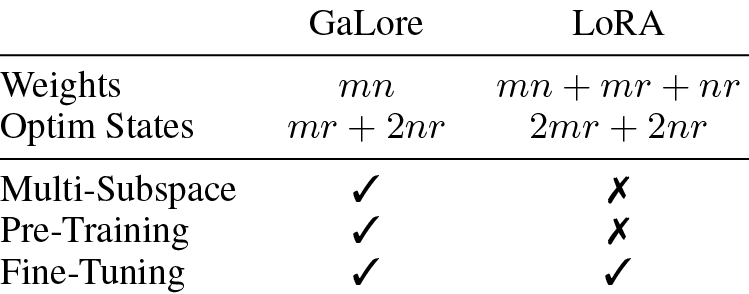

GaLore

LoRA

Weights

Optim States

mn

mr + 2nr

mn + mr + nr 2mr + 2nr

Multi-Subspace

✓

✗

Pre-Training

✓

✗

Fine-Tuning

✓

✓

cost of projection matrices by quantization and efficient parameterization, which we leave for future work.

## 4.3. Combining with Existing Techniques

GaLore is compatible with existing memory-efficient optimization techniques. In our work, we mainly consider applying GaLore with 8-bit optimizers and per-layer weight updates.

8-bit optimizers. Dettmers et al. (2022) proposed 8-bit Adam optimizer that maintains 32-bit optimizer performance at a fraction of the memory footprint. We apply Ga-Lore directly to the existing implementation of 8-bit Adam.

Per-layer weight updates. In practice, the optimizer typically performs a single weight update for all layers after backpropagation. This is done by storing the entire weight gradients in memory. To further reduce the memory footprint during training, we adopt per-layer weight updates to GaLore, which performs the weight updates during back-propagation. This is the same technique proposed in recent works to reduce memory requirement (Lv et al., 2023a;b).

## 4.4. Hyperparameters of GaLore

In addition to Adam’s original hyperparameters, GaLore only introduces very few additional hyperparameters: the rank r which is also present in LoRA, the subspace change frequency T (see Sec. 4.1), and the scale factor α.

Scale factor α controls the strength of the low-rank update, which is similar to the scale factor α/r appended to the low-rank adaptor in Hu et al. (2022). We note that the α does not depend on the rank r in our case. This is because, when r is small during pre-training, α/r significantly affects the convergence rate, unlike fine-tuning.

# 5. Experiments

We evaluate GaLore on both pre-training and fine-tuning of LLMs. All experiments run on NVIDIA A100 GPUs.

Pre-training on C4. To evaluate its performance, we apply GaLore to train LLaMA-based large language models on the C4 dataset. C4 dataset is a colossal, cleaned version

Table 2: Comparison with low-rank algorithms on pre-training various sizes of LLaMA models on C4 dataset. Validation perplexity is reported, along with a memory estimate of the total of parameters and optimizer states based on BF16 format. The actual memory footprint of GaLore is reported in Fig. 4.

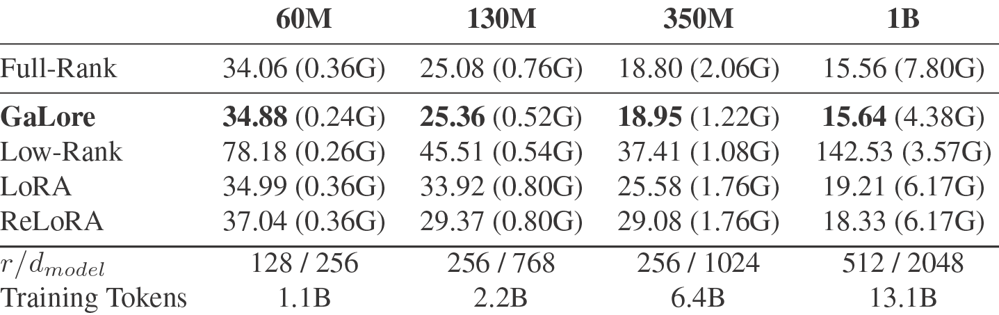

60M

130M

350M

1B

Full-Rank

34.06 (0.36G)

25.08 (0.76G)

18.80 (2.06G)

15.56 (7.80G)

GaLore

34.88 (0.24G)

25.36 (0.52G)

18.95 (1.22G)

15.64 (4.38G)

Low-Rank

78.18 (0.26G)

45.51 (0.54G)

37.41 (1.08G)

142.53 (3.57G)

LoRA

34.99 (0.36G)

33.92 (0.80G)

25.58 (1.76G)

19.21 (6.17G)

ReLoRA

37.04 (0.36G)

29.37 (0.80G)

29.08 (1.76G)

18.33 (6.17G)

r/dmodel

128 / 256

256 / 768

256 / 1024

512 / 2048

Training Tokens

1.1B

2.2B

6.4B

13.1B

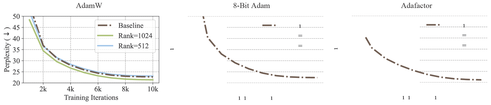

AdamW 8-Bit Adam Adafactor

Figure 3: Applying GaLore to different optimizers for pre-training LLaMA 1B on C4 dataset for 10K steps. Validation perplexity over training steps is reported. We apply GaLore to each optimizer with the rank of 512 and 1024, where the 1B model dimension is 2048.

Table 3: Pre-training LLaMA 7B on C4 dataset for 150K steps. Validation perplexity and memory estimate are reported.

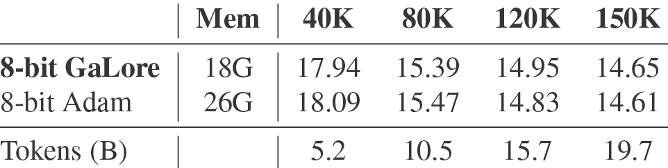

Mem

40K

80K

120K

150K

8-bit GaLore

18G

17.94

15.39

14.95

14.65

8-bit Adam

26G

18.09

15.47

14.83

14.61

Tokens (B)

5.2

10.5

15.7

19.7

of Common Crawl’s web crawl corpus, which is mainly intended to pre-train language models and word representations (Raffel et al., 2020). To best simulate the practical pre-training scenario, we train without data repetition over a sufficiently large amount of data, across a range of model sizes up to 7 Billion parameters.

Architecture and hyperparameters. We follow the experiment setup from Lialin et al. (2024), which adopts a LLaMA-based3 architecture with RMSNorm and SwiGLU activations (Zhang & Sennrich, 2019; Shazeer, 2020; Tou-vron et al., 2023). For each model size, we use the same set of hyperparameters across methods, except the learning rate. We run all experiments with BF16 format to reduce memory usage, and we tune the learning rate for each method under the same amount of computational budget and report the best performance. The details of our task setups and hyperparameters are provided in the appendix.

3LLaMA materials in our paper are subject to LLaMA community license.

Fine-tuning on GLUE tasks. GLUE is a benchmark for evaluating the performance of NLP models on a variety of tasks, including sentiment analysis, question answering, and textual entailment (Wang et al., 2019). We use GLUE tasks to benchmark GaLore against LoRA for memory-efficient fine-tuning.

## 5.1. Comparison with Existing Low-Rank Methods

We first compare GaLore with existing low-rank methods using Adam optimizer across a range of model sizes.

Full-Rank Our baseline method that applies Adam optimizer with full-rank weights and optimizer states.

Low-Rank We also evaluate a traditional low-rank approach that represents the weights by learnable low-rank factorization: W = BA (Kamalakara et al., 2022).

LoRA Hu et al. (2022) proposed LoRA to fine-tune pre-trained models with low-rank adaptors: W = W0 + BA, where W0 is fixed initial weights and BA is a learnable low-rank adaptor. In the case of pre-training, W0 is the full-rank initialization matrix. We set LoRA alpha to 32 and LoRA dropout to 0.05 as their default settings.

ReLoRA Lialin et al. (2024) proposed ReLoRA, a variant of LoRA designed for pre-training, which periodically merges BA into W, and initializes new BA with a reset on

optimizer states and learning rate. ReLoRA requires careful tuning of merging frequency, learning rate reset, and optimizer states reset. We evaluate ReLoRA without a full-rank training warmup for a fair comparison.

For GaLore, we set subspace frequency T to 200 and scale factor α to 0.25 across all model sizes in Table 2. For each model size, we pick the same rank r for all low-rank methods, and we apply them to all multi-head attention layers and feed-forward layers in the models. We train all models using Adam optimizer with the default hyperparame-ters (e.g., β1 = 0.9, β2 = 0.999, ϵ = 10−8). We also estimate the memory usage based on BF16 format, including the memory for weight parameters and optimizer states. As shown in Table 2, GaLore outperforms other low-rank methods and achieves comparable performance to full-rank training. We note that for 1B model size, GaLore even outperforms full-rank baseline when r = 1024 instead of r = 512. Compared to LoRA and ReLoRA, GaLore requires less memory for storing model parameters and optimizer states. A detailed training setting of each model and memory estimation for each method are in the appendix.

## 5.2. GaLore with Memory-Efficient Optimizers

We demonstrate that GaLore can be applied to various learning algorithms, especially memory-efficient optimizers, to further reduce the memory footprint. We apply GaLore to AdamW, 8-bit Adam, and Adafactor optimizers (Shazeer & Stern, 2018; Loshchilov & Hutter, 2019; Dettmers et al., 2022). We consider Adafactor with first-order statistics to avoid performance degradation.

We evaluate them on LLaMA 1B architecture with 10K training steps, and we tune the learning rate for each setting and report the best performance. As shown in Fig. 3, applying GaLore does not significantly affect their convergence. By using GaLore with a rank of 512, the memory footprint is reduced by up to 62.5%, on top of the memory savings from using 8-bit Adam or Adafactor optimizer. Since 8-bit Adam requires less memory than others, we denote 8-bit GaLore as GaLore with 8-bit Adam, and use it as the default method for the following experiments on 7B model pre-training and memory measurement.

## 5.3. Scaling up to LLaMA 7B Architecture

Scaling ability to 7B models is a key factor for demonstrating if GaLore is effective for practical LLM pre-training scenarios. We evaluate GaLore on an LLaMA 7B architecture with an embedding size of 4096 and total layers of 32. We train the model for 150K steps with 19.7B tokens, using 8-node training in parallel with a total of 64 A100 GPUs. Due to computational constraints, we compare 8-bit Ga-Lore (r = 1024) with 8-bit Adam with a single trial without tuning the hyperparameters. As shown in Table 3, after

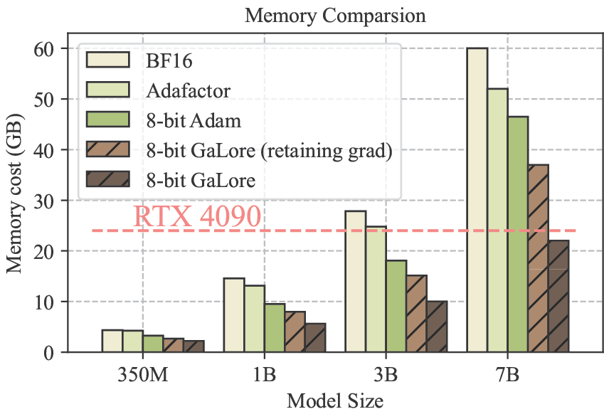

350M 1B 3B 7B Model Size 0 10 20 30 40 50 60 Memory cost (GB)RTX 4090 Memory Comparsion BF16 Adafactor 8-bit Adam 8-bit GaLore (retaining grad) 8-bit GaLore

Figure 4: Memory usage for different methods at various model sizes, evaluated with a token batch size of 256. 8-bit GaLore (retaining grad) disables per-layer weight updates but stores weight gradients during training.

150K steps, 8-bit GaLore achieves a perplexity of 14.65, comparable to 8-bit Adam with a perplexity of 14.61.

## 5.4. Memory-Efficient Fine-Tuning

GaLore not only achieves memory-efficient pre-training but also can be used for memory-efficient fine-tuning. We fine-tune pre-trained RoBERTa models on GLUE tasks using GaLore and compare its performance with a full fine-tuning baseline and LoRA. We use hyperparameters from Hu et al. (2022) for LoRA and tune the learning rate and scale factor for GaLore. As shown in Table 4, GaLore achieves better performance than LoRA on most tasks with less memory footprint. This demonstrates that GaLore can serve as a full-stack memory-efficient training strategy for both LLM pre-training and fine-tuning.

## 5.5. Measurement of Memory and Throughput

While Table 2 gives the theoretical benefit of GaLore compared to other methods in terms of memory usage, we also measure the actual memory footprint of training LLaMA models by various methods, with a token batch size of 256. The training is conducted on a single device setup without activation checkpointing, memory offloading, and optimizer states partitioning (Rajbhandari et al., 2020).

Training 7B models on consumer GPUs with 24G memory. As shown in Fig. 4, 8-bit GaLore requires significantly less memory than BF16 baseline and 8-bit Adam, and only requires 22.0G memory to pre-train LLaMA 7B with a small per-GPU token batch size (up to 500 tokens). This memory footprint is within 24GB VRAM capacity of a single GPU such as NVIDIA RTX 4090. In addition, when activation checkpointing is enabled, per-GPU token batch size can be increased up to 4096. While the batch size is small per GPU, it can be scaled up with data parallelism, which requires much lower bandwidth for inter-GPU communication, compared to model parallelism. Therefore, it

Table 4: Evaluating GaLore for memory-efficient fine-tuning on GLUE benchmark using pre-trained RoBERTa-Base. We report the average score of all tasks.

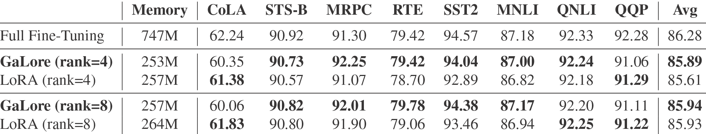

Memory

CoLA

STS-B

MRPC

RTE

SST2

MNLI

QNLI

QQP

Avg

Full Fine-Tuning

747M

62.24

90.92

91.30

79.42

94.57

87.18

92.33

92.28

86.28

GaLore (rank=4)

253M

60.35

90.73

92.25

79.42

94.04

87.00

92.24

91.06

85.89

LoRA (rank=4)

257M

61.38

90.57

91.07

78.70

92.89

86.82

92.18

91.29

85.61

GaLore (rank=8)

257M

60.06

90.82

92.01

79.78

94.38

87.17

92.20

91.11

85.94

LoRA (rank=8)

264M

61.83

90.80

91.90

79.06

93.46

86.94

92.25

91.22

85.93

is possible that GaLore can be used for elastic training (Lin et al., 2019) 7B models on consumer GPUs such as RTX 4090s.

Specifically, we present the memory breakdown in Fig. 1. It shows that 8-bit GaLore reduces 37.92G (63.3%) and 24.5G (52.3%) total memory compared to BF16 Adam baseline and 8-bit Adam, respectively. Compared to 8-bit Adam, 8-bit GaLore mainly reduces the memory in two parts: (1) low-rank gradient projection reduces 9.6G (65.5%) memory of storing optimizer states, and (2) using per-layer weight updates reduces 13.5G memory of storing weight gradients.

Throughput overhead of GaLore. We also measure the throughput of the pre-training LLaMA 1B model with 8-bit GaLore and other methods, where the results can be found in the appendix. Particularly, the current implementation of 8-bit GaLore achieves 1019.63 tokens/second, which induces 17% overhead compared to 8-bit Adam implementation. Disabling per-layer weight updates for GaLore achieves 1109.38 tokens/second, improving the throughput by 8.8%. We note that our results do not require offloading strategies or checkpointing, which can significantly impact training throughput. We leave optimizing the efficiency of GaLore implementation for future work.

# 6. Ablation Study

How many subspaces are needed during pre-training? We observe that both too frequent and too slow changes of subspaces hurt the convergence, as shown in Fig. 5 (left). The reason has been discussed in Sec. 4.1. In general, for small r, the subspace switching should happen more to avoid wasting optimization steps in the wrong subspace, while for large r the gradient updates cover more subspaces, providing more cushion.

How does the rank of subspace affect the convergence?

Within a certain range of rank values, decreasing the rank only slightly affects the convergence rate, causing a slowdown with a nearly linear trend. As shown in Fig. 5 (right), training with a rank of 128 using 80K steps achieves a lower loss than training with a rank of 512 using 20K steps.

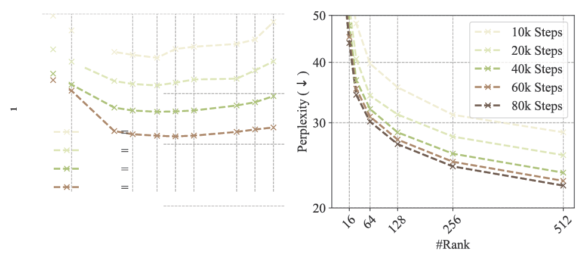

Figure 5: Ablation study of GaLore on 130M models. Left: varying subspace update frequency T . Right: varying subspace rank and training iterations.

This shows that GaLore can be used to trade-off between memory and computational cost. In a memory-constrained scenario, reducing the rank allows us to stay within the memory budget while training for more steps to preserve the performance.

# 7. Conclusion

We propose GaLore, a memory-efficient pre-training and fine-tuning strategy for large language models. GaLore significantly reduces memory usage by up to 65.5% in optimizer states while maintaining both efficiency and performance for large-scale LLM pre-training and fine-tuning.

We identify several open problems for GaLore, which include (1) applying GaLore on training of various models such as vision transformers (Dosovitskiy et al., 2021) and diffusion models (Ho et al., 2020), (2) further enhancing memory efficiency by employing low-memory projection matrices, and (3) exploring the feasibility of elastic data distributed training on low-bandwidth consumer-grade hardware.

We hope that our work will inspire future research on memory-efficient training from the perspective of gradient low-rank projection. We believe that GaLore will be a valuable tool for the community, enabling the training of large-scale models on consumer-grade hardware with limited resources.

# Impact Statement

This paper aims to improve the memory efficiency of training LLMs in order to reduce the environmental impact of LLM pre-training and fine-tuning. By enabling the training of larger models on hardware with lower memory, our approach helps to minimize energy consumption and carbon footprint associated with training LLMs.

# Acknowledgments

We thank Meta AI for computational support. We appreciate the helpful feedback and discussion from Florian Sch¨afer, Jeremy Bernstein, and Vladislav Lialin. B. Chen greatly appreciates the support by Moffett AI. Z. Wang is in part supported by NSF Awards 2145346 (CAREER), 02133861 (DMS), 2113904 (CCSS), and the NSF AI Institute for Foundations of Machine Learning (IFML). A. Anandkumar is supported by the Bren Foundation and the Schmidt Sciences through AI 2050 senior fellow program.

# References

Anil, R., Gupta, V., Koren, T., and Singer, Y. Memory efficient adaptive optimization. Advances in Neural Information Processing Systems, 2019.

BELLEGroup. Belle: Be everyone’s large language model engine. (<https://github.com/LianjiaTech/BELLE>)https://github.com/LianjiaTech/ (<https://github.com/LianjiaTech/BELLE>)BELLE, 2023.

Chaudhry, A., Khan, N., Dokania, P., and Torr, P. Continual learning in low-rank orthogonal subspaces. Advances in Neural Information Processing Systems, 2020.

Chen, H., Raskutti, G., and Yuan, M. Non-Convex Projected Gradient Descent for Generalized Low-Rank Tensor Regression. Journal of Machine Learning Research, 2019.

Chen, T., Xu, B., Zhang, C., and Guestrin, C. Training Deep Nets with Sublinear Memory Cost. ArXiv preprint arXiv:1604.06174, 2016.

Chen, Y. and Wainwright, M. J. Fast low-rank estimation by projected gradient descent: General statistical and algorithmic guarantees. ArXiv preprint arXiv:1509.03025, 2015.

Chowdhery, A., Narang, S., Devlin, J., Bosma, M., Mishra, G., Roberts, A., Barham, P., Chung, H. W., Sutton, C., Gehrmann, S., et al. Palm: Scaling language modeling with pathways. Journal of Machine Learning Research, 2023.

Cosson, R., Jadbabaie, A., Makur, A., Reisizadeh, A., and Shah, D. Low-Rank Gradient Descent. IEEE Open Journal of Control Systems, 2023.

Dettmers, T., Lewis, M., Shleifer, S., and Zettlemoyer, L. 8-bit optimizers via block-wise quantization. In The Tenth International Conference on Learning Representations, ICLR 2022, Virtual Event, April 25-29, 2022. OpenReview.net, 2022.

Dettmers, T., Pagnoni, A., Holtzman, A., and Zettlemoyer, L. Qlora: Efficient finetuning of quantized llms. Advances in Neural Information Processing Systems, 2024.

Ding, N., Qin, Y., Yang, G., Wei, F., Yang, Z., Su, Y., Hu, S., Chen, Y., Chan, C.-M., Chen, W., Yi, J., Zhao, W., Wang, X., Liu, Z., Zheng, H.-T., Chen, J., Liu, Y., Tang, J., Li, J., and Sun, M. Delta Tuning: A Comprehensive Study of Parameter Efficient Methods for Pre-trained Language Models. ArXiv preprint arXiv:2203.06904, 2022.

Dosovitskiy, A., Beyer, L., Kolesnikov, A., Weissenborn, D., Zhai, X., Unterthiner, T., Dehghani, M., Minderer, M., Heigold, G., Gelly, S., Uszkoreit, J., and Houlsby, N. An image is worth 16x16 words: Transformers for image recognition at scale. In International Conference on Learning Representations, 2021.

Gooneratne, M., Sim, K. C., Zadrazil, P., Kabel, A., Beau-fays, F., and Motta, G. Low-rank gradient approximation for memory-efficient on-device training of deep neural network. In 2020 IEEE International Conference on Acoustics, Speech and Signal Processing, ICASSP 2020, Barcelona, Spain, May 4-8, 2020. IEEE, 2020.

Gur-Ari, G., Roberts, D. A., and Dyer, E. Gradient Descent Happens in a Tiny Subspace. ArXiv preprint arXiv:1812.04754, 2018.

Hao, Y., Cao, Y., and Mou, L. Flora: Low-Rank Adapters Are Secretly Gradient Compressors. ArXiv preprint arXiv:2402.03293, 2024.

Ho, J., Jain, A., and Abbeel, P. Denoising diffusion probabilistic models. Advances in neural information processing systems, 2020.

Hu, E. J., Shen, Y., Wallis, P., Allen-Zhu, Z., Li, Y., Wang, S., Wang, L., and Chen, W. Lora: Low-rank adaptation of large language models. In The Tenth International Conference on Learning Representations, ICLR 2022, Virtual Event, April 25-29, 2022. OpenReview.net, 2022.

Huang, S., Hoskins, B. D., Daniels, M. W., Stiles, M. D., and Adam, G. C. Low-Rank Gradient Descent for Memory-Efficient Training of Deep In-Memory Arrays. ACM Journal on Emerging Technologies in Computing Systems, 2023.

Kamalakara, S. R., Locatelli, A., Venkitesh, B., Ba, J., Gal, Y., and Gomez, A. N. Exploring Low Rank Training of Deep Neural Networks. ArXiv preprint arXiv:2209.13569, 2022.

Kingma, D. P. and Ba, J. Adam: A method for stochastic optimization. In 3rd International Conference on Learning Representations, ICLR 2015, San Diego, CA, USA, May 7-9, 2015, Conference Track Proceedings, 2015.

Kopf,¨ A., Kilcher, Y., von Rutte,¨ D., Anagnostidis, S., Tam, Z. R., Stevens, K., Barhoum, A., Nguyen, D., Stan-ley, O., Nagyfi, R., et al. Openassistant conversations-democratizing large language model alignment. Ad-vances in Neural Information Processing Systems, 2024.

Larsen, B. W., Fort, S., Becker, N., and Ganguli, S. How many degrees of freedom do we need to train deep networks: a loss landscape perspective. In The Tenth International Conference on Learning Representations, ICLR 2022, Virtual Event, April 25-29, 2022. OpenReview.net, 2022.

Lee, Y. and Choi, S. Gradient-based meta-learning with learned layerwise metric and subspace. In Proceedings of the 35th International Conference on Machine Learning, ICML 2018, Stockholmsmassan,¨ Stockholm, Sweden, July 10-15, 2018. PMLR, 2018.

Li, B., Chen, J., and Zhu, J. Memory efficient optimizers with 4-bit states. Advances in Neural Information Processing Systems, 2024.

Lialin, V., Muckatira, S., Shivagunde, N., and Rumshisky, A. ReloRA: High-rank training through low-rank updates. In The Twelfth International Conference on Learning Representations, 2024.

Lin, H., Zhang, H., Ma, Y., He, T., Zhang, Z., Zha, S., and Li, M. Dynamic mini-batch sgd for elastic distributed training: Learning in the limbo of resources. arXiv preprint arXiv:1904.12043, 2019.

Loshchilov, I. and Hutter, F. Decoupled weight decay regularization. In 7th International Conference on Learning Representations, ICLR 2019, New Orleans, LA, USA, May 6-9, 2019. OpenReview.net, 2019.

Lv, K., Yan, H., Guo, Q., Lv, H., and Qiu, X. AdaLomo: Low-memory Optimization with Adaptive Learning Rate. ArXiv preprint arXiv:2310.10195, 2023a.

Lv, K., Yang, Y., Liu, T., Gao, Q., Guo, Q., and Qiu, X. Full Parameter Fine-tuning for Large Language Models with Limited Resources. ArXiv preprint arXiv:2306.09782, 2023b.

Modoranu, I.-V., Kalinov, A., Kurtic, E., Frantar, E., and Alistarh, D. Error Feedback Can Accurately Compress Preconditioners. ArXiv preprint arXiv:2306.06098, 2023.

Rae, J. W., Borgeaud, S., Cai, T., Millican, K., Hoffmann, J., Song, F., Aslanides, J., Henderson, S., Ring, R., Young, S., et al. Scaling language models: Methods, analysis & insights from training gopher. arXiv preprint arXiv:2112.11446, 2021.

Raffel, C., Shazeer, N., Roberts, A., Lee, K., Narang, S., Matena, M., Zhou, Y., Li, W., and Liu, P. J. Exploring the limits of transfer learning with a unified text-to-text transformer. J. Mach. Learn. Res., 2020.

Rajbhandari, S., Rasley, J., Ruwase, O., and He, Y. Zero: Memory optimizations toward training trillion parameter models. In SC20: International Conference for High Performance Computing, Networking, Storage and Analysis, 2020.

Rajpurkar, P., Zhang, J., Lopyrev, K., and Liang, P. SQuAD: 100,000+ questions for machine comprehension of text. In Proceedings of the 2016 Conference on Empirical Methods in Natural Language Processing. Association for Computational Linguistics, 2016.

Renduchintala, A., Konuk, T., and Kuchaiev, O. Tied-Lora: Enhacing parameter efficiency of LoRA with weight tying. ArXiv preprint arXiv:2311.09578, 2023.

Shazeer, N. Glu variants improve transformer. arXiv preprint arXiv:2002.05202, 2020.

Shazeer, N. and Stern, M. Adafactor: Adaptive learning rates with sublinear memory cost. In Proceedings of the 35th International Conference on Machine Learning, ICML 2018, Stockholmsmassan,¨ Stockholm, Sweden, July 10-15, 2018. PMLR, 2018.

Sheng, Y., Cao, S., Li, D., Hooper, C., Lee, N., Yang, S., Chou, C., Zhu, B., Zheng, L., Keutzer, K., Gon-zalez, J. E., and Stoica, I. S-LoRA: Serving Thou-sands of Concurrent LoRA Adapters. ArXiv preprint arXiv:2311.03285, 2023.

Team, G., Mesnard, T., Hardin, C., Dadashi, R., Bhu-patiraju, S., Pathak, S., Sifre, L., Rivi`ere, M., Kale, M. S., Love, J., et al. Gemma: Open models based on gemini research and technology. arXiv preprint arXiv:2403.08295, 2024.

Tian, Y., Yu, L., Chen, X., and Ganguli, S. Understanding self-supervised learning with dual deep networks. ArXiv preprint arXiv:2010.00578, 2020.

Tian, Y., Wang, Y., Zhang, Z., Chen, B., and Du, S. S. JoMA: Demystifying multilayer transformers via joint dynamics of MLP and attention. In The Twelfth International Conference on Learning Representations, 2024.

Touvron, H., Martin, L., Stone, K., Albert, P., Almahairi, A., Babaei, Y., Bashlykov, N., Batra, S., Bhargava, P., Bhosale, S., et al. Llama 2: Open foundation and fine-tuned chat models. arXiv preprint arXiv:2307.09288, 2023.

Vogels, T., Karimireddy, S. P., and Jaggi, M. Practical low-rank communication compression in decentralized deep learning. Advances in Neural Information Processing Systems, 2020.

Wang, A., Singh, A., Michael, J., Hill, F., Levy, O., and Bowman, S. R. GLUE: A multi-task benchmark and analysis platform for natural language understanding. In 7th International Conference on Learning Representations, ICLR 2019, New Orleans, LA, USA, May 6-9, 2019. OpenReview.net, 2019.

Wang, H., Sievert, S., Liu, S., Charles, Z., Papailiopoulos, D., and Wright, S. Atomo: Communication-efficient learning via atomic sparsification. Advances in neural information processing systems, 31, 2018.

Wang, H., Agarwal, S., Tanaka, Y., Xing, E., Papailiopou-los, D., et al. Cuttlefish: Low-rank model training without all the tuning. Proceedings of Machine Learning and Systems, 2023a.

Wang, Y., Lin, Y., Zeng, X., and Zhang, G. MultiLoRA: Democratizing LoRA for Better Multi-Task Learning. ArXiv preprint arXiv:2311.11501, 2023b.

Wortsman, M., Dettmers, T., Zettlemoyer, L., Morcos, A., Farhadi, A., and Schmidt, L. Stable and low-precision training for large-scale vision-language models. Advances in Neural Information Processing Systems, 2023.

Xia, W., Qin, C., and Hazan, E. Chain of LoRA: Efficient Fine-tuning of Language Models via Residual Learning. ArXiv preprint arXiv:2401.04151, 2024.

Yang, G., Simon, J. B., and Bernstein, J. A spectral condition for feature learning. arXiv preprint arXiv:2310.17813, 2023.

Zhai, X., Kolesnikov, A., Houlsby, N., and Beyer, L. Scaling Vision Transformers. In 2022 IEEE/CVF Conference on Computer Vision and Pattern Recognition (CVPR). IEEE, 2022.

Zhang, B. and Sennrich, R. Root mean square layer normalization. Advances in Neural Information Processing Systems, 32, 2019.

Zhang, L., Zhang, L., Shi, S., Chu, X., and Li, B. Lora-fa: Memory-efficient low-rank adaptation for large language models fine-tuning. arXiv preprint arXiv:2308.03303, 2023.

Zhao, J., Schaefer, F. T., and Anandkumar, A. Zero initialization: Initializing neural networks with only zeros and ones. Transactions on Machine Learning Research, 2022.

Zhao, J., Zhang, Y., Chen, B., Sch¨afer, F., and Anandku-mar, A. Inrank: Incremental low-rank learning. arXiv preprint arXiv:2306.11250, 2023.

# A. Additional Related Works

Adafactor (Shazeer & Stern, 2018) achieves sub-linear memory cost by factorizing the second-order statistics by a row-column outer product. GaLore shares similarities with Adafactor in terms of utilizing low-rank factorization to reduce memory cost, but GaLore focuses on the low-rank structure of the gradients, while Adafactor focuses on the low-rank structure of the second-order statistics.

GaLore can reduce the memory cost for both first-order and second-order statistics, and can be combined with Adafactor to achieve further memory reduction. In contrast to the previous memory-efficient optimization methods, GaLore operates independently as the optimizers directly receive the low-rank gradients without knowing their full-rank counterparts.

The fused backward operation proposed by LOMO (Lv et al., 2023b) mitigates the memory cost of storing weight gradients during training. Integrated with the standard SGD optimizer, LOMO achieves zero optimizer and gradient memory cost during training. AdaLOMO (Lv et al., 2023a) enhances this approach by combining the fused backward operation with adaptive learning rate for each parameter, similarly achieving minimal optimizer memory cost.

While LOMO and AdaLOMO represent significant advancements in memory-efficient optimization for fine-tuning or continual pre-training, they might not be directly applicable to pre-training from scratch at larger scales. For example, the vanilla Adafactor, adopted by AdaLOMO, has been demonstrated to lead to increased training instabilities at larger scales (Rae et al., 2021; Chowdhery et al., 2023; Wortsman et al., 2023; Zhai et al., 2022). We believe integrating GaLore with the fused backward operation may offer a promising avenue for achieving memory-efficient large-scale pre-training from scratch.

# B. Proofs

## B.1. Reversibility

Definition B.1 (Reversiblity (Tian et al., 2020)). A network N that maps input x to output y = N (x) is reversible, if there exists L(x; W) so that y = L(x; W)x, and the backpropagated gradient gx satisfies gx = L⊤(x; W)gy, where gy is the backpropagated gradient at the output y. Here L(x; W) depends on the input x and weight W in the network N .

Note that many layers are reversible, including linear layer (without bias), reversible activations (e.g., ReLU, leaky ReLU, polynomials, etc). Furthermore, they can be combined to construct more complicated architectures:

Property 1. If N1 and N2 are reversible networks, then (Parallel) y = α1N1(x) + α2N2(x) is reversible for constants α1 and α2, and (Composition) y = N2(N1(x)) is reversible.

From this property, it is clear that ResNet architecture x + N (x) is reversible, if N contains bias-free linear layers and reversible activations, which is often the case in practice. For a detailed analysis, please check Appendix A in (Tian et al., 2020). For architectures like self-attention, one possibility is to leverage JoMA (Tian et al., 2024) to analyze, and we leave for future work.

The gradient of chained reversible networks has the following structure:

Theorem 3.2 (Gradient Form of reversible models). Consider a chained reversible neural network N (x) := NL(NL−1(...N1(x))) and define Jl := Jacobian(NL) ...Jacobian(Nl+1) and fl := Nl(...N1(x)). Then the weight matrix Wl at layer l has gradient Gl in the following form for batch size 1:

- (a)

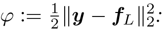

- 1
- 2
- L
- 2
- 2
- φ := ∥y − f∥:
- For ℓ2-objective

Gl =  J ⊤ l y −J ⊤ l JlWlfl−1  f ⊤ l−1

(6)

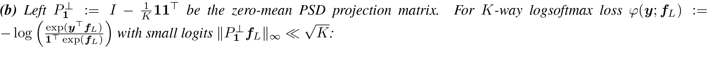

(b) Left P ⊥ 1 := I− 1 K 11⊤ be the zero-mean PSD projection matrix. For K-way logsoftmax loss φ(y; fL) := − log  exp(y ⊤ fL) 1⊤ exp(fL)  with small logits ∥P ⊥ 1 fL∥∞ ≪ √ K:

Gl =  JlP ⊥ 1y − γK−1 J ⊤ l P ⊥ 1 JlWlfl−1  f ⊤ l−1

(7)

where γ ≈ 1 and y is a data label with y⊤1 = 1.

Proof. Note that for layered reversible network, we have

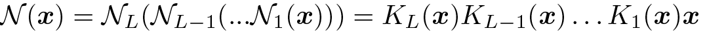

N (x) = NL(NL−1(...N1(x))) = KL(x)KL−1(x) . . . K1(x)x

(16)

Let fl := Nl(Nl−1(. . . N1(x))) and Jl := KL(x) . . . Kl+1(x), and for linear layer l, we can write N (x) = JlWlfl−1. Therefore, for the linear layer l with weight matrix Wl, we have:

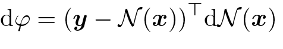

dφ = (y − N (x)) ⊤ dN (x)

(17)

= (y − N (x))⊤KL(x) . . . Kl+1(x)dWlfl−1 + terms not related to dWl

(18)

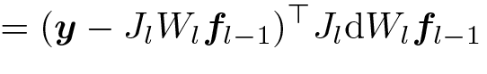

= (y − JlWlfl−1)⊤ JldWlfl−1

(19)

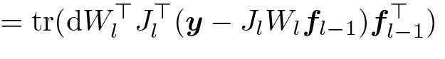

= tr(dW ⊤ l J ⊤ l (y − JlWlfl−1)f ⊤ l−1)

(20)

This gives the gradient of Wl:

Gl =J ⊤ l yf⊤ l−1 −J ⊤ l JlWlfl−1f ⊤ l−1

(21)

Softmax Case. Note that for softmax objective with small logits, we can also prove a similar structure of backpropagated gradient, and thus Theorem 3.2 can also apply.  

φ(y; f) := −

exp(y⊤ f)

1⊤ exp(f)

,

⊥

f = P 1 ˆ f

K

⊤

f , where P ⊥ 1 := I − 1 11, then we have:

Lemma B.2 (Gradient structure of softmax loss). For K-way logsoftmax loss log let be the version of network outputzero-mean

−dφ = y ⊤ dˆf − γ ˆf ⊤ dˆf/K + O( ˆf 2 /K)d ˆf

(22)

where γ(y, f) ≈ 1 and y is a data label with y⊤1 = 1.

Proof. Let f ⊥ˆ := P f be the zero-mean version of network output f. Then we have 1⊤fˆ 1= 0 and f = fˆ+c1. Therefore, we have:

−φ = log  exp(c) exp(y ⊤ˆf) exp(c)1⊤ exp( ˆf)  =y ⊤ˆf − log(1 ⊤ exp( ˆf))

(23)

x2

2

2

exp(x) = 1 + x + + o(x),

Using the Taylor expansion we have:

1 ⊤ exp( ˆf) = 1 ⊤(1 + ˆf+ 1 2 ˆf 2) + o( ˆf 2) = K(1 + ˆf ⊤ ˆf/2K + o( ˆf 2 /K))

(24)

So

−φ = y ⊤ˆf − log(1 + ˆf ⊤ ˆf/2K + o( ˆf 2 /K)) − log K

(25)

Therefore

−dφ = y ⊤ dˆf− γ K ˆf ⊤ dˆf +O  ˆf2 K  d ˆf

(26)

where γ := (1 + ˆf⊤ ˆf/2K + o( ˆf2/K))−1 ≈ 1.

Remarks. With this lemma, it is clear that for a reversible network f := N (x) = Jl(x)Wlfl−1(x), the gradient Gl of Wl has the following form:

Gl = JlP ⊥ 1yfl−1   A − γJ ⊤ l P ⊥ 1 Jl   B Wl fl−1f ⊤ l−1/K    C

(27)

## B.2. Gradient becomes low-rank

Lemma B.3 (Gradient becomes low-rank during training). Suppose the gradient follows the parametric form:

Gt = 1N N i=1 (Ai − BiWtCi)

(8)

with constant Ai, PSD matrices Bi and Ci after t ≥ t0. We study vanilla SGD weight update: Wt = Wt−1 + ηGt−1. Let S := 1 NN i=1 Ci ⊗ Bi and λ1 < λ2 its two smallest distinct eigenvalues. Then the stable rank sr(Gt) satisfies:

sr(Gt) ≤ sr(G ∥ t0 )+  1−ηλ2 1−ηλ1  2(t−t0 ) ∥G0 −G ∥ t0 ∥2 F ∥G ∥ t0 ∥2 2

(9)

∥

t0

G

where is the projection of Gt0 onto the minimal eigenspace V1 of S corresponding to λ1.

Proof. We have

Gt = 1N N i=1 (Ai − BiWtCi) = 1N N i=1 Ai − Bi(Wt−1 + ηGt−1)Ci = Gt−1 − ηN N i=1 BiGt−1Ci

(28)

1

N

N i=1

i

i

S := C⊗ B,

t

t

mn

g:= vec(G) ∈ R

t

m×n

G∈ R.

Let and be a vectorized version of the gradient Using vec(BWC) = (C⊤ ⊗ B)vec(W), we have:

gt = (I − ηS)gt−1

(29)

Now let’s bound the stable rank of Gt:

stable-rank(Gt) := ∥Gt∥2 F ∥Gt∥2 2

(30)

0

∥

0

⊥

0

g= g + g,

∥

0

g

Now λ1 < λ2 are the smallest two distinct eigenvectors of S. The smallest eigenvalue λ1 has multiplicity κ1. We can decompose g0 into two components, in which lies in the κ1-dimensional eigenspace V1 that corresponds to the minimal eigenvalue λ1, and g0⊥ is its residue. Then V1 ⊂ Rmn and its orthogonal complements are invariant subspaces under S and thus:

∥Gt∥ 2 F = ∥gt∥ 2 2 = ∥(I − ηS)t g0∥ 2 2 = ∥(I − ηS)t g∥ 0 ∥ 2 2 + ∥(I − ηS)t g⊥ 0 ∥ 2 2 ≤ (1 − ηλ2)2t ∥g⊥ 0 ∥ 2 2 + (1 − ηλ1)2t ∥g∥ 0 ∥ 2 2

(31)

(32)

On the other hand, by our assumption, G0∥ is rank L and thus has SVD decomposition:

G ∥ 0 = L l=1 clzly⊤ l

(33)

with orthonormal unit vectors {zl}lL=1 and {yl}lL=1 and singular values {cl}lL=11. This means that

g∥ 0 = vec(G ∥ 0) = L l=1 cl(yl ⊗ zl) =: L l=1 clvl

(34)

with unit vector vl := yl ⊗ zl ∈ V1. It is clear that

v ⊤ l vl ′ = (y⊤ l ⊗z ⊤ l )(yl ′ ⊗ zl ′ ) = (y⊤ l yl ′ )(z ⊤ l zl ′ ) = I(l = l ′ )

(35)

Therefore, by the definition of spectral norm (or matrix 2-norm), we know it corresponds to the largest singular value, which means:

∥Gt∥2 = max ∥y ′ ∥2=1,∥z ′ ∥2 =1 z ′ ⊤ Gty ′

(36)

≥ max l z ⊤ l Gtyl = maxl (yl ⊗ zl)⊤ gt

(37)

= max l v ⊤ l (1 − ηS)t g0 = (1 − ηλ1)t max l v ⊤ l g0

(38)

Note that the last equation is because any v ∈ V1 is an eigenvector of S with eigenvalue of λ1.

Since v ⊤ l g0 = v ⊤ l (g ⊥ 0 + g ∥ 0 ) = c l , max l cl = ∥G ∥0∥2 and ∥g ∥0 ∥2 2= ∥G ∥ 0∥2 F, we have:

stable-rank(Gt) := ∥Gt∥2 F ∥Gt∥2 2 ≤ stable-rank(G ∥ 0) +  1 − ηλ2 1 − ηλ1  2t ∥G⊥ 0 ∥2 F ∥G ∥ 0 ∥2 2

(39)

t

1

N

Ni=1

i

i

t

i

i

G= ⊤(a− BWf)f

i

t0

N := rank({f}) < n, then sr(G) ≤ n − N ′∥′

t

sr(G) ≤ n/2

Corollary B.4 (Low-rank Gt). If the gradient takes theparametric form with all Bi full-rank, and and thus for large t.

Proof. Let Ci = fif ⊤ i ∈ Rn×n . Since N ′ := rank({fi}N i=1) < n and fi ∈ Rn , the collections of vectors {fi}Ni=1 cannot span the entire space R n . Let {uj }n−N ′ j=1 be the orthonormal bases for the null space of {fi}N i=1, and {ek}mk=1 be any orthonormal bases for R m . Then the product bases {uj ⊗ ek} form a set of bases for the minimal eigenspace V1 of S with the minimal eigenvalue of 0. Since Bi are full-rank, no extra dimensions exist for V1.

Therefore, when we project Gt0 onto V1, we have:

G ∥ t0 = n−N ′  j=1 m k=1 cjkuje ⊤ k = n−N ′  j=1 uj  m k=1 cjkek ⊤

(40)

t0

t0

sr(G ∥) ≤ rank(G) ≤ n − N , ∥′

and thus since stable rank is a lower-bound of the rank.

i

′

ij

j

′rank-1 matrices, by representing each f=  N j=1 ′ bf

j

N

j

′

=1

{f′ }:

On the other hand, Gt can be written as a summation of N as a linear combination of

Gt = 1N N i=1 (ai − BiWtfi)   N ′  j=1 b ij f′ j   ⊤ = 1N N ′  j=1  N i=1 b ij(ai − BiWtfi)  f ′ ⊤ j

(41)

39
3.3
and thus has rank at most N ′ . Therefore, when t is sufficiently large so that the second term in Eqn. is negligible, by Lemma , we have (notice that N ′ < n):

sr(Gt) ≤ min(n − N ′ , N ′ ) ≤ n/2

(42)

v = y ⊗ z,

t0

t

sr(G) = 1 and thus Gbecomes rank-1. ∥

Corollary B.5 (Low-rank Gt with special structure of V1). If V1(S) is 1-dimensional with decomposable eigenvector then

Proof. In this case, we have g ∥ 0 = vv ⊤ g0 ∝ v. Since v = y ⊗ z, the resulting G ∥ 0 is a rank-1 matrix and thus sr(G ∥t0 ) = 1.

## B.3. Gradient Low-rank property for Transformers

Note that Transformers do not belong to the family of reversible networks. However, we can still show that the gradient of the lower layer (i.e., project-up) weight W ∈ Rm×n of feed forward network (FFN) becomes low rank over time, using the JoMA framework (Tian et al., 2024). Here m is the embedding dimension, and n is the number of hidden nodes in FFNs.

Lemma B.6 (Gradient of Project-up in Transformer FFNs). Suppose the embedding matrix U ∈ Rm×M is fixed and column-orthonormal (M is vocabulary size), the activation functions are linear and the backpropagated gradient are stationary (Tian et al., 2024), then the training dynamics of transformed project-up matrix V := U⊤W ∈ RM×n satisfies the following:

˙V = 1 A diag  exp  V ◦V 2  1  ∆

(43)

where A is the normalization factor of softmax, ◦ is the Hadamard (element-wise) product and ∆ is defined in the proof. As a result, the gradient of V is “exponentially more low-rank” than V itself.

Proof. Let ∆ := [∆1, . . . , ∆n] ∈ RM×n , where ∆j := Eq[gjx] ∈ RM . Here gj is the backpropagated gradient of hidden node j in FFN layer, Eq[·] is the conditional expectation given the query is token q, and x is the representation of token distribution in the previous layer of Transformer. Specifically, for intermediate layer, x represents the activation output of the previous project-up layer; for the first layer, x represents the frequency count of the input tokens. Then following the derivation of Theorem 2 (Tian et al., 2024), we have for each hidden node j and its weight wj, the transformed weight vj := U⊤wj satisfies the following dynamics:

˙vj = 1 A ∆j ◦ exp(v 2 j /2)

(44)

where vj 2 := vj ◦ vj is the element-wise square of a vector and ◦ is the Hadamard (element-wise) product. Since V := [v1, . . . , vn], Eqn. 43 follows.

j

(because of exp(v 2 /), and it is not2)

Note that the dynamics of vj shows that the direction of vj will change over time clear how such dynamics leads to low-rank V and even more low-rank V˙ . For this, we per-row decompose the matrix V :

V :=   u ⊤ 1 u ⊤ 2 . . . u ⊤ M  

(45)

where ul ∈ Rn . We can also do the same for ∆:

∆ :=   µ⊤ 1 µ⊤ 2 . . . µ⊤ M  

(46)

where µl ∈ Rn . Then Eqn. 43 can be decomposed along each row:

˙ul = 1 A(e u 2l· 1)µl

(47)

Then it is clear that ul is always along the direction of µl, which is a fixed quality since the backpropagated gradient gj and input x are assumed to be stationary (and thus ∆j := Eq[gjx] is a constant).

Therefore, let ul(t) = αl(t)µl with initial condition of the magnitude αl(0) = 0, and we have:

˙αl = 1 A e α2lµ2l·1 = 1 A n j=1 e α 2lµ2 lj

(48)

where 1 ≤ l ≤ M is the token index. In the following we will show that for different l, the growth of αl can be very different. This leads to very different row norms of V and V˙ over time, leading to their low-rank structures. Note that Eqn. 48 does not have a close form solution, instead we could estimate its growth:

1 A e α2l ¯µ2l≤˙αl ≤ n A e α2l ¯µ2l

(49)

where µ¯2l := maxj µ2lj.

2

√

π

−t

erf(x) = 2 x 0edt ∈ [−1,1].

˙x= Ce22 β x ,

Note that both sides have analytic solutions using Gaussian error functions Specifically, for dynamic system like we have

e−β 2 x 2 dx = Cdt

(50)

which gives:

√ π 2β erf (βx(t)) =  x(t) 0 e−β 2 y 2 dy = Ct

(51)

or

x(t) = 1 β erf−1  2βC √ π t 

(52)

For inequality like x˙ ≥ Ceβ x or x˙ ≤ Ceβ x , similar equation can be 2222derived. Plug that in, we have:

1 ¯µl erf−1  2¯µl A √ π t  ≤ αl(t) ≤ 1 ¯µl erf−1  2n¯µl A √ π t 

(53)

Let

h(t; a) := 1 a erf−1  2 √ πa A t 

(54)

then limt→A√π/2a h(t; a) = +∞, and h(t; ¯µl) ≤ αl(t) ≤ nh(t; n¯µl).

Let l∗ = arg maxl ¯µ∗l be the row with the largest entry of µ, then if ¯µ∗l > n¯µl for all l ̸= l∗ , then when t → t∗ := A√ l Since αl(t) controls the magnitude of each row of V , This means that V eventually becomes rank-1 and so does W. π 2¯µ ∗, the magnitude αl∗ (t) ≥ h(t; ¯µl∗ ) → +∞, while αl(t) ≤ nh(t; n¯µl) still stay finite, since its critical time t′ := A√ π2n¯µl > t∗ .

Finally, V˙ is even more low rank than V , since α˙ l has αl in its exponents.

## B.4. Convergence of GaLore

t

∥W∥ ≤ D.

t

⊤

t

t

t

it

⊤

t

i

t

t

R:= PGQ, ˆB:= PB(W)P,

it

⊤

t

i

t

t

ˆC:= QC(W)Q

t

1

N

i

min

it

min

it

κ:= λ( ˆB)λ( ˆC).

t

P= P

t

Q= Q,

t

ρ≡ 1

Theorem 3.8 (Convergence of GaLore with fixed projections). Suppose the gradient has the form of Eqn. 8 and Ai, Bi and Ci have LA, LB and LC continuity with respect to W and Let and If we choose constant and then GaLore with satisfies:

∥Rt∥F ≤  1−η(κt−1 −LA −LBLC D 2)  ∥Rt−1∥F

(11)

As a result, if mint κt > LA + LBLC D2 , Rt → 0 and thus GaLore converges with fixed Pt and Qt.

Proof. Using vec(AXB) = (B⊤ ⊗ A)vec(X) where ⊗ is the Kronecker product, the gradient assumption can be written as the following:

gt = at − Stwt

(55)

where gt:= vec(Gt) ∈ Rmn , wt := vec(Wt) ∈ Rmn be the vectorized versions of Gt and Wt, at := 1 N  i vec(Ait) and St = 1 Ni Cit ⊗ Bit are mn-by-mn PSD matrix.

Using the same notation, it is clear to show that:

(Q ⊗ P)⊤ gt = (Q ⊤ ⊗P ⊤ )vec(Gt) = vec(P ⊤ GtQ) = vec(Rt) =: rt

(56)

˜gt := vec( ˜Gt) = vec(PP ⊤ GtQQ ⊤) = (Q ⊗ P)vec(Rt) = (Q ⊗ P)rt

(57)

Then we derive the recursive update rule for gt:

gt = at − Stwt

(58)

= (at − at−1) + (St−1 − St)wt + at−1 − St−1wt

(59)

= et + at−1 − St−1(wt−1 + η˜gt−1)

(60)

= et + gt−1 − ηSt−1g˜t−1

(61)

where et := (at − at−1) + (St−1 − St)wt. Left multiplying by (Q ⊗ P)⊤ , we have:

rt = (Q ⊗ P)⊤ et + rt−1 − η(Q ⊗ P)⊤ St−1(Q ⊗ P)rt−1

(62)

Let

ˆSt := (Q ⊗ P)⊤ St(Q ⊗ P) = 1N  i (Q ⊗ P)⊤(Cit ⊗ Bit)(Q ⊗ P) = 1N  i (Q ⊤ CitQ) ⊗ (P ⊤ BitP)

(63)

Then we have:

rt = (I − η ˆSt−1)rt−1 + (Q ⊗ P)⊤ et

(64)

Now we bound the norm. Note that since P and Q are projection matrices with P⊤P = I and Q⊤Q = I, we have:

∥(Q ⊗ P)⊤ et∥2 = ∥vec(P ⊤ EtQ)∥2 = ∥P ⊤ EtQ∥F ≤ ∥Et∥F

(65)

t

1

N

i

it

i,t−1

1

N

i

i,t−1

t

i,t−1

it

t

it

E:= (A− A) + (BWC− BWC).

where So we only need to bound ∥Et∥F . Note that:

∥At − At−1∥F ≤ LA∥Wt − Wt−1∥F = ηLA∥ ˜Gt−1∥F ≤ ηLA∥Rt−1∥F

(66)

∥(Bt − Bt−1)WtCt−1∥F ≤ LB∥Wt − Wt−1∥F ∥Wt∥F ∥Ct−1∥F = ηLBLC D 2 ∥Rt−1∥F ∥BtWt(Ct−1 − Ct)∥F ≤ LC ∥Bt∥F ∥Wt∥F ∥Wt−1 − Wt∥F = ηLBLC D 2 ∥Rt−1∥F

(67)

(68)

t−1

ˆS.

Now we estimate the minimal eigenvalue of Let λit := λmin(P⊤BitP) and νit := λmin(Q⊤CitQ), then λmin((P⊤BitP) ⊗ (Q⊤CitQ)) = λitνit and for any unit vector v:

v ⊤ˆStv = 1N  i v ⊤  (P ⊤ BitP) ⊗ (Q ⊤ CitQ)  v≥ 1N  i λ it ν it

(69)

And thus λmin(ˆSt) ≥ 1 N1 i λitνit. Therefore, λmax(I − η ˆSt−1) ≤ 1 − η Ni λi,t−1νi,t−1. Therefore, let κt := N i λitνit and using the fact that ∥rt∥2 = ∥Rt∥F , we have:

∥Rt∥F ≤  1 − η(κt−1 − LA − 2LBLC D 2)  ∥Rt−1∥F

(70)

and the conclusion follows.

# C. Details of Pre-Training Experiment

## C.1. Architecture and Hyperparameters

We introduce details of the LLaMA architecture and hyperparameters used for pre-training. Table 5 shows the most hyperparameters of LLaMA models across model sizes. We use a max sequence length of 256 for all models, with a batch size of 131K tokens. For all experiments, we adopt learning rate warmup for the first 10% of the training steps, and use cosine annealing for the learning rate schedule, decaying to 10% of the initial learning rate.

Table 5: Hyperparameters of LLaMA models for evaluation. Data amount are specified in tokens.

Params

Hidden

Intermediate

Heads

Layers

Steps

Data amount

60M

512

1376

8

8

10K

1.3 B

130M

768

2048

12

12

20K

2.6 B

350M

1024

2736

16

24

60K

7.8 B

1B

2048

5461

24

32

100K

13.1 B

7B

4096

11008

32

32

150K

19.7 B

For all methods on each size of models (from 60M to 1B), we tune their favorite learning rate from a set of {0.01, 0.005, 0.001, 0.0005, 0.0001}, and the best learning rate is chosen based on the validation perplexity. We find GaLore is insensitive to hyperparameters and tends to be stable with the same learning rate across different model sizes. For all models, GaLore use the same hyperparameters, including the learning rate of 0.01, scale factor α of 0.25, and the subspace change frequency of T of 200. We note that since α can be viewed as a fractional learning rate, most of the modules (e.g., multi-head attention and feed-forward layers) in LLaMA models have the actual learning rate of 0.0025. This is, still, a relatively large stable learning rate compared to the full-rank baseline, which usually uses a learning rate ≤ 0.001 to avoid spikes in the training loss.

## C.2. Memory Estimates

As the GPU memory usage for a specific component is hard to measure directly, we estimate the memory usage of the weight parameters and optimizer states for each method on different model sizes. The estimation is based on the number of original parameters and the number of low-rank parameters, trained by BF16 format. For example, for a 60M model, LoRA (r = 128) requires 42.7M parameters on low-rank adaptors and 60M parameters on the original weights, resulting in a memory cost of 0.20G for weight parameters and 0.17G for optimizer states. Table 6 shows the memory estimates for weight parameters and optimizer states for different methods on different model sizes, as a compliment to the total memory reported in the main text.

Table 6: Memory estimates for weight parameters and optimizer states.

(a) Memory estimate of weight parameters.

60M

130M

350M

1B

Full-Rank

0.12G

0.25G

0.68G

2.60G

GaLore

0.12G

0.25G

0.68G

2.60G

Low-Rank

0.08G

0.18G

0.36G

1.19G

LoRA

0.20G

0.44G

1.04G

3.79G

ReLoRA

0.20G

0.44G

1.04G

3.79G

- (b)
- Memory estimate of optimizer states.

60M

130M

350M

1B

Full-Rank

0.23G

0.51G

1.37G

5.20G

GaLore

0.13G

0.28G

0.54G

1.78G

Low-Rank

0.17G

0.37G

0.72G

2.38G

LoRA

0.17G

0.37G

0.72G

2.38G

ReLoRA

0.17G

0.37G

0.72G

2.38G

## C.3. Training Progression

We show the training progression of 130M, 350M, 1B and 7B models in Figure 6. Compared to LoRA, GaLore closely matches the training trajectory of the full-rank baseline, and it even converges slightly faster at the beginning of the training.

0.5 1.0 1.5 2.0 Token Seen (Billions) 20 25 30 35 40 45 50 Perplexity LLaMA-130M Baseline LoRA GaLore

0 2 4 6 8 Token Seen (Billions) 15 20 25 30 35 40 Perplexity LLaMA-350M Baseline LoRA GaLore

0.0 2.5 5.0 7.5 10.0 12.5 Token Seen (Billions) 15 20 25 30 Perplexity LLaMA-1B Baseline LoRA GaLore Perplexity

Figure 6: Training progression for pre-training LLaMA models on C4 dataset.

0 5 10 15 20 Token Seen (Billions) 14 16 18 20 22 24 LLaMA-7B 8-bit AdamW 8-bit GaLore

# D. Fine-Tuning Experiments

## D.1. Details of Fine-Tuning on GLUE

We fine-tune the pre-trained RoBERTa-Base model on the GLUE benchmark using the model provided by the Hugging Face1 . We trained the model for 30 epochs with a batch size of 16 for all tasks except for CoLA, which uses a batch size of 32. We tune the learning rate and scale factor for GaLore. Table 7 shows the hyperparameters used for fine-tuning RoBERTa-Base for GaLore.

Table 7: Hyperparameters of fine-tuning RoBERTa base for GaLore.

MNLI

SST-2

MRPC

CoLA

QNLI

QQP

RTE

STS-B

Batch Size

16

16

16

32

16

16

16

16

# Epochs

30

30

30

30

30

30

30

30

Learning Rate

1E-05

1E-05

3E-05

3E-05

1E-05

1E-05

1E-05

1E-05

Rank Config.

r=4

GaLore α

4

Max Seq. Len.

512

MNLI

SST-2

MRPC

CoLA

QNLI

QQP

RTE

STS-B

Batch Size

16

16

16

32

16

16

16

16

# Epochs

30

30

30

30

30

30

30

30

Learning Rate

1E-05

2E-05

2E-05

1E-05

1E-05

2E-05

2E-05

3E-05

Rank Config.

r=8

GaLore α

2

Max Seq. Len.

512

## D.2. Fine-Tuning on SQuAD dataset

We evaluate GaLore on the SQuAD dataset (Rajpurkar et al., 2016) using the pre-trained BERT-Base model. We use rank 16 for both GaLore and LoRA. GaLore outperforms LoRA in both Exact Match and F1 scores.

Table 8: Evaluating GaLore on SQuAD dataset. Both Exact Match and F1 scores are reported.

Exact Match

F1

Baseline

80.83

88.41

GaLore

80.52

88.29

LoRA

77.99

86.11

## D.3. Fine-Tuning on OpenAssistant Conversations Dataset

We apply GaLore on fine-tuning experiments on the OpenAssistant Conversations dataset (Kopf¨ et al., 2024), using the pre-trained models, including Gemma-2b, Phi-2, and LLaMA-7B (Touvron et al., 2023; Team et al., 2024). We use rank of 128 for both GaLore and LoRA. The results are shown in Table 9.

## D.4. Fine-Tuning on Belle-1M Dataset

We also apply GaLore on fine-tuning experiments on the Belle-1M dataset (BELLEGroup, 2023), using the pre-trained models, including Gemma-2b, Phi-2, and LLaMA-7B. We use rank of 128 for both GaLore and LoRA. The results are shown in Table 10.

1(<https://huggingface.co/transformers/model_doc/roberta.html>)https://huggingface.co/transformers/model_doc/roberta.html

Table 9: Evaluating GaLore on OpenAssistant Conversations dataset. Testing perplexity is reported.

Gemma-2b

Phi-2

LLaMA-7B

Baseline

4.53

3.81

2.98

GaLore

4.51

3.83

2.95

LoRA

4.56

4.24

2.94

Table 10: Evaluating GaLore on Belle-1M dataset. Testing perplexity is reported.

Gemma-2b

Phi-2

LLaMA-7B

Baseline

5.44

2.66

2.27

GaLore

5.35

2.62

2.28

LoRA

5.37

2.75

2.30

# E. Additional Memory Measurements

We empirically measure the memory usage of different methods for pre-training LLaMA 1B model on C4 dataset with a token batch size of 256, as shown in Table 11.

Table 11: Measuring memory and throughput on LLaMA 1B model.

Model Size

Layer Wise

Methods

Token Batch Size

Memory Cost

Throughput

#Tokens / s

#Samples / s

1B

✘

AdamW

256

13.60

1256.98

6.33

Adafactor

256

13.15

581.02

2.92

Adam8bit

256

9.54

1569.89

7.90

8-bit GaLore

256

7.95

1109.38

5.59

1B

✔

AdamW

256

9.63

1354.37

6.81

Adafactor

256

10.32

613.90

3.09

Adam8bit

256

6.93

1205.31

6.07

8-bit GaLore

256

5.63

1019.63

5.13
