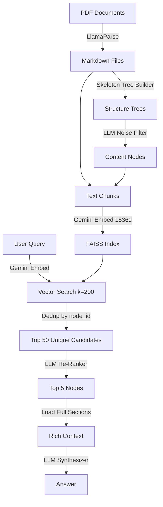

# Proxy-Pointer

<p align="center">
  
</p>

**Structural RAG for Document Analysis** — A hierarchical, pointer-based RAG pipeline that retrieves full document sections using structural tree navigation instead of blind vector similarity.

---

## How It Works



Instead of retrieving small, context-less chunks, Proxy-Pointer:

1. **Builds a structural tree** of each document (like a table of contents) — pure Python, no external deps
2. **Filters noise** (TOC, abbreviations, foreword, etc.) using an LLM
3. **Indexes structural pointers** — each chunk carries metadata about its position in the document hierarchy
4. **Re-ranks by structure** — an LLM re-ranker selects the most relevant sections by their hierarchical path, not just embedding similarity
5. **Loads full sections** — the synthesizer sees complete document sections, not truncated 2000-char chunks

---

## Architecture Deep Dive

Refer to [Proxy-Pointer RAG: Achieving Vectorless Accuracy at Vector RAG Scale and Cost](https://towardsdatascience.com/proxy-pointer-rag-achieving-vectorless-accuracy-at-vector-rag-scale-and-cost/) for a detailed explanation of the architecture.

---

## Benchmark Results

Proxy-Pointer has been evaluated against the **FinanceBench** dataset using four FY2022 10-K filings (AMD, American Express, Boeing, PepsiCo).

| Benchmark | Questions | k_final | Accuracy |
|---|---|---|---|
| FinanceBench (26 questions) | Qualitative + quantitative | k=5 | **100%** (26/26) |
| FinanceBench (26 questions) | Qualitative + quantitative | k=3 | **96.2%** (25/26) |
| Comprehensive (40 questions) | Complex financial calculations | k=5 | **100%** (40/40) |
| Comprehensive (40 questions) | Complex financial calculations | k=3 | **92.5%** (37/40) |

Full scorecards and comparison logs are available in `data/Benchmark/`.

---

## 5-Minute Quickstart

A pre-extracted Markdown file (`AMD.md`) for AMD's FY2022 10-K is included so you can build the index and start querying immediately — no PDF extraction required.

> **Want to try more companies?** Additional Markdown files for American Express, Boeing, and PepsiCo are available in `data/documents/md_files/`. Copy them into `data/documents/` and rebuild the index.

### 1. Clone

```bash
git clone https://github.com/youruser/Proxy-Pointer.git
cd Proxy-Pointer
```

### 2. Create virtual environment (recommended)

```bash
python -m venv venv

# Windows
venv\Scripts\activate

# macOS / Linux
source venv/bin/activate
```

### 3. Install dependencies

```bash
pip install -r requirements.txt
```

### 4. Configure API keys

```bash
cp .env.example .env
# Edit .env → add your GOOGLE_API_KEY
```

### 5. Build the index

```bash
python -m src.indexing.build_pp_index --fresh
```

This builds a FAISS index from the pre-shipped `AMD.md` file.

### 6. Start querying

```bash
python -m src.agent.pp_rag_bot
```

Try a query like:
```
User >> What is AMD's quick ratio for FY2022?
```

---

## Running Benchmarks

To evaluate the pipeline against a set of ground truth questions:

```bash
python -m src.agent.benchmark <path_to_excel_file>
```

The Excel file should have `Question` and `Answer` (or `Ground Truth`) columns. The benchmark script will:
1. Run each question through the RAG bot
2. Use an LLM-as-a-judge to score each response
3. Generate a timestamped log file and scorecard in `data/results/`

---

## Adding Your Own Documents

### Option A: You already have Markdown files

1. Place `.md` files in `data/documents/`
2. Run the indexer (it will auto-build skeleton trees):
   ```bash
   python -m src.indexing.build_pp_index --fresh
   ```

### Option B: Start from PDFs

1. Add `LLAMA_CLOUD_API_KEY` to your `.env` file
2. Place PDFs in `data/pdf/`
3. Extract to markdown:
   ```bash
   python -m src.extraction.extract_pdf_to_md
   ```
4. Build the index:
   ```bash
   python -m src.indexing.build_pp_index --fresh
   ```

---

## Project Structure

```
Proxy-Pointer/
├── src/
│   ├── config.py                      # Centralized configuration
│   ├── extraction/
│   │   └── extract_pdf_to_md.py       # PDF → Markdown (LlamaParse)
│   ├── indexing/
│   │   ├── build_skeleton_trees.py    # Markdown → structural tree (pure Python)
│   │   └── build_pp_index.py          # Noise filter + chunking + FAISS indexing
│   └── agent/
│       ├── pp_rag_bot.py              # Interactive RAG bot
│       └── benchmark.py               # Automated benchmarking with LLM-as-a-judge
├── data/
│   ├── pdf/                           # Source PDFs (4 FinanceBench 10-Ks included)
│   ├── documents/
│   │   ├── AMD.md                     # Pre-extracted — ready for quickstart
│   │   └── md_files/                  # Additional Markdown files (AMEX, Boeing, PepsiCo)
│   ├── trees/                         # Structure tree JSONs (auto-generated)
│   ├── index/                         # Generated FAISS index (gitignored)
│   └── Benchmark/                     # Benchmark results and scorecards
│       ├── FinanceBench/              # FinanceBench scorecards (k=3 and k=5)
│       ├── Comprehensive k=5/         # 40-question evaluation logs and scorecards
│       └── Comprehensive k=3/         # 40-question evaluation logs and scorecards
└── examples/
    └── sample_queries.md              # Example queries to try
```

---

## Configuration

All configuration is centralized in `src/config.py`. Override via environment variables:

| Variable | Default | Description |
|---|---|---|
| `GOOGLE_API_KEY` | (required) | Gemini API key |
| `LLAMA_CLOUD_API_KEY` | (optional) | LlamaParse API key for PDF extraction |
| `PP_DATA_DIR` | `data/documents/` | Markdown source directory |
| `PP_TREES_DIR` | `data/trees/` | Structure tree directory |
| `PP_INDEX_DIR` | `data/index/` | FAISS index directory |
| `PP_RESULTS_DIR` | `data/results/` | Benchmark results directory |

---

## Components

### 1. Extraction Layer (`src/extraction/`)

**PDF → Markdown** via LlamaParse.

- Preserves document hierarchy (headings, tables, lists)
- Outputs one `.md` file per PDF
- Idempotent: skips already-extracted files

### 2. Indexing Layer (`src/indexing/`)

Three-stage pipeline:

#### Stage 0: Skeleton Tree Building (`build_skeleton_trees.py`)
- Self-contained, pure-Python module (~150 lines) that parses Markdown headings into a hierarchical tree
- Tree nodes represent document sections with `node_id`, `title`, and `line_num`
- Zero external dependencies — no LLM calls, no subprocess invocations

#### Stage 1: LLM Noise Filter
- Sends the skeleton tree JSON to Gemini Flash Lite
- Identifies noise nodes across 6 categories:
  - Table of Contents
  - Abbreviations / Glossary
  - Acknowledgments
  - Foreword / Preface
  - Executive Summary
  - References / Bibliography
- Returns a set of `node_id`s to exclude
- Temperature 0.0 for deterministic results

#### Stage 2: Chunk, Embed, Index
- For each non-noise node:
  - Extracts text between `line_num` boundaries
  - Parent nodes: text stops at first child's `line_num` (no overlap with children)
  - Splits into 2000-char chunks with 200-char overlap
  - Enriches with hierarchical breadcrumb: `[Parent > Child > Section]\nchunk_text`
  - Stores metadata: `doc_id`, `node_id`, `title`, `breadcrumb`, `start_line`, `end_line`
- Embeds with `gemini-embedding-001` at **1536 dimensions** (half of default 3072)
- Saves as FAISS index

### 3. Retrieval Layer (`src/agent/`)

Two-stage retrieval:

#### Stage 1: Broad Vector Recall
- Embeds query with same 1536-dim model
- FAISS similarity search returns top 200 chunks
- Deduplicates by `node_id` and shortlists to the **Top 50** unique candidate nodes

#### Stage 2: LLM Structural Re-Ranker
- Sends candidate hierarchical paths (breadcrumbs) to Gemini
- LLM ranks by **structural relevance**, not embedding similarity
- Returns top 5 unique node IDs
- Fallback: if re-ranker fails, uses top 5 by similarity

#### Synthesis
- For each selected node: loads the **full section text** from the source `.md` file using `start_line` / `end_line` pointers
- Injects breadcrumb as `### REFERENCE` header for grounding
- Gemini synthesizes a grounded answer citing sources

---

## Design Decisions

### Why 1536 dimensions?
Gemini's `gemini-embedding-001` defaults to 3072 dimensions. We use `output_dimensionality=1536`:
- **50% smaller** FAISS index files
- **Faster** similarity search
- **Minimal accuracy loss** — for structural retrieval (breadcrumb matching), the re-ranker does the heavy lifting; embeddings just need to get the right candidates into the top 200

### Why LLM noise filter instead of regex?
Hardcoded title matching (`NOISE_TITLES = {"contents", "foreword", ...}`) breaks on:
- Variations: "Note of Thanks" vs "Acknowledgments"
- Formatting: "**Table of Contents**" vs "TABLE OF CONTENTS"
- Language: concept-based matching catches semantic equivalents

### Why structural re-ranker?
Standard vector RAG returns chunks by embedding similarity. A query about "AMD's cash flow" might surface a paragraph that **mentions** cash flow, but the actual Cash Flow Statement table is structurally elsewhere. The re-ranker sees `AMD > Financial Statements > Cash Flows` as a breadcrumb and knows it's the right section.

### Why full-section loading?
The indexed chunk is max 2000 chars — often just a fragment of a table or section. The synthesizer needs the **complete** section (including headers, full tables, footnotes) for accurate answers. The chunk acts as a **pointer**; the full section is the **payload**.

---

## Dependencies

- [Gemini](https://ai.google.dev/) — Embeddings, noise filter, re-ranker, synthesis
- [LangChain](https://github.com/langchain-ai/langchain) + [FAISS](https://github.com/facebookresearch/faiss) — Vector indexing
- [LlamaParse](https://cloud.llamaindex.ai/) — PDF to Markdown extraction (optional)
- [Pandas](https://pandas.pydata.org/) — Benchmark data loading (optional)

---

## Feedback & Contact

For questions, feedback, or to report a bug, please use the following channels:

- **GitHub Issues**: For bug reports and feature requests.
- **GitHub Discussions**: For general questions, ideas, and community chat. You can reach out to me on [LinkedIn](www.linkedin.com/in/partha-sarkar-lets-talk-ai) or [Email](partha.sarkarx@gmail.com).

---

## License

MIT — see [LICENSE](LICENSE).
