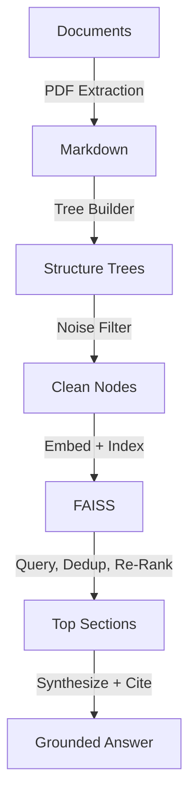

  

# Proxy-Pointer RAG Suite -- Now with Multimodal Answering Capability 🔍

**Structural RAG for Complex Documents** — A high-fidelity retrieval pipeline that uses document hierarchy as the primary retrieval anchor, eliminating "hallucination by chunking." Proxy-Pointer indexes **structural pointers** (breadcrumbs like `Paper > Section > Sub-section`) rather than raw text fragments, ensuring the LLM always understands exactly where it is in a document.

---

## Two Implementations, One Architecture

| Feature | [Text-Only](./Text-Only) | [MultiModal](./MultiModal) |
| :--- | :--- | :--- |
| **Core Goal** | Maximum precision for text-based RAG | Unified reasoning across text & visuals |
| **Input** | Structured Markdown (LlamaParse) | Markdown + Figures/Tables (Adobe Extract) |
| **Output** | Text-based answers | Text + $\color{#15803d}{\textsf{\textbf{AI-Verified Visual Evidence}}}$ 🖼️ |
| **LLM** | Gemini 3.1 Flash-Lite | Gemini 3.1 Flash-Lite |
| **Embeddings** | gemini-embedding-001 (1536d) | gemini-embedding-001 (1536d) |
| **Vision** | — | ✅ Gemini 3.1 Flash-Lite |
| **Retrieval** | Structural re-ranking (k=5) | Anchor-aware re-ranking + image selection |
| **Benchmark** | 100% on FinanceBench & 40-question Comprehensive | 96% across 20-query, 5-paper technical suite |
| **Use Case** | 10-K Financials, Legal, Documentation | Anything with Images, Diagrams, Charts, Tables |
| **Interface** | CLI / Python API | Streamlit UI with visual citations |

---

## How It Works

1. **Structure trees** map every section, sub-section, figure, and table in a document
2. **Noise filtering** removes TOC, glossaries, and boilerplate using an LLM
3. **Broad vector recall** (k=200) retrieves candidates, then **LLM re-ranking** selects the best structural matches
4. **Full section loading** gives the synthesizer complete context — not truncated chunks
5. *(MultiModal only)* **Anchor-aware retrieval** surfaces figures/tables physically linked to retrieved sections

---

## Which One Should I Use?

**[Text-Only](./Text-Only)** — Best when your documents are purely text-based and the hierarchy (e.g., `Signatory > Item 1A > Risk Factors`) is the only context needed. Proven at 100% accuracy on financial 10-K filings.

**[MultiModal](./MultiModal)** — Best when your documents contain diagrams, charts, and tables that are essential to the answer. Uses anchor-aware retrieval to surface the exact images tied to a technical discussion, tested across 5 research papers (CLIP, GaLore, NemoBot, VectorFusion, VectorPainter).

---

## Architecture Deep Dive

For the full technical story behind the architecture:

1. [Proxy-Pointer RAG: Achieving Vectorless Accuracy at Vector RAG Scale and Cost](https://towardsdatascience.com/proxy-pointer-rag-achieving-vectorless-accuracy-at-vector-rag-scale-and-cost/) — Core architecture & the pointer-based retrieval idea
2. [Proxy-Pointer RAG: Structure Meets Scale — 100% Accuracy with Smarter Retrieval](https://towardsdatascience.com/proxy-pointer-rag-structure-meets-scale-100-accuracy-with-smarter-retrieval/) — Scaling to multi-document, LLM re-ranking, and benchmark results

---

## Quick Start

Each implementation has its own self-contained README with a 5-minute quickstart:

- **[Text-Only → Get Started](./Text-Only/README.md)**  
- **[MultiModal → Get Started](./MultiModal/README.md)**

Both include sample data so you can clone, build the index, and start querying immediately.

---

## Feedback & Contact

- **GitHub Issues**: For bug reports
- **General Questions**: Reach out on [LinkedIn](https://www.linkedin.com/in/partha-sarkar-lets-talk-ai) or [Email](mailto:partha.sarkarx@gmail.com)

---

## License

© 2026 Proxy-Pointer. Licensed under [MIT](LICENSE).
