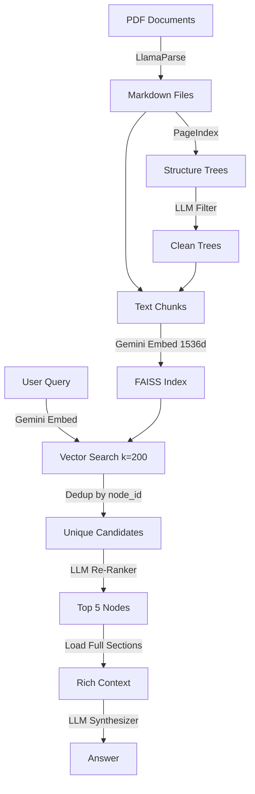

# Proxy-Pointer Architecture

## Pipeline Overview

---

## Components

### 1. Extraction Layer (`src/extraction/`)

**PDF → Markdown** via LlamaParse.

- Preserves document hierarchy (headings, tables, lists)
- Outputs one `.md` file per PDF
- Idempotent: skips already-extracted files

### 2. Indexing Layer (`src/indexing/`)

Three-stage pipeline:

#### Stage 0: Skeleton Tree Building
- Uses [PageIndex](https://github.com/VectifyAI/PageIndex) to generate a hierarchical tree from each `.md` file
- Tree nodes represent document sections with `node_id`, `title`, and `line_num`
- Disables AI summarization for speed (`--if-add-node-summary no`)

#### Stage 1: LLM Noise Filter
- Sends the full tree JSON to Gemini Flash Lite
- Identifies noise nodes across 6 categories:
  - Table of Contents
  - Abbreviations / Glossary
  - Acknowledgments
  - Foreword / Preface
  - Executive Summary
  - References / Bibliography
- Returns a set of `node_id`s to exclude
- Temperature 0.0 for deterministic results

#### Stage 2: Chunk, Embed, Index
- For each non-noise node:
  - Extracts text between `line_num` boundaries
  - Parent nodes: text stops at first child's `line_num` (no overlap with children)
  - Splits into 2000-char chunks with 200-char overlap
  - Enriches with hierarchical breadcrumb: `[Parent > Child > Section]\nchunk_text`
  - Stores metadata: `doc_id`, `node_id`, `title`, `breadcrumb`, `start_line`, `end_line`
- Embeds with `gemini-embedding-001` at **1536 dimensions** (half of default 3072)
- Saves as FAISS index

### 3. Retrieval Layer (`src/agent/`)

Two-stage retrieval:

#### Stage 1: Broad Vector Recall
- Embeds query with same 1536-dim model
- FAISS similarity search returns top 200 chunks
- Deduplicates by `node_id` → ~50 unique candidate nodes

#### Stage 2: LLM Structural Re-Ranker
- Sends candidate hierarchical paths (breadcrumbs) to Gemini
- LLM ranks by **structural relevance**, not embedding similarity
- Returns top 5 unique node IDs
- Fallback: if re-ranker fails, uses top 5 by similarity

#### Synthesis
- For each selected node: loads the **full section text** from the source `.md` file using `start_line` / `end_line` pointers
- Injects breadcrumb as `### REFERENCE` header for grounding
- Gemini synthesizes a grounded answer citing sources

---

## Design Decisions

### Why 1536 dimensions?
Gemini's `gemini-embedding-001` defaults to 3072 dimensions. We use `output_dimensionality=1536`:
- **50% smaller** FAISS index files
- **Faster** similarity search
- **Minimal accuracy loss** — for structural retrieval (breadcrumb matching), the re-ranker does the heavy lifting; embeddings just need to get the right candidates into the top 200

### Why LLM noise filter instead of regex?
Hardcoded title matching (`NOISE_TITLES = {"contents", "foreword", ...}`) breaks on:
- Variations: "Note of Thanks" vs "Acknowledgments"
- Formatting: "**Table of Contents**" vs "TABLE OF CONTENTS"
- Language: concept-based matching catches semantic equivalents

### Why structural re-ranker?
Standard vector RAG returns chunks by embedding similarity. A query about "AMD's cash flow" might surface a paragraph that **mentions** cash flow, but the actual Cash Flow Statement table is structurally elsewhere. The re-ranker sees `AMD > Financial Statements > Cash Flows` as a breadcrumb and knows it's the right section.

### Why full-section loading?
The indexed chunk is max 2000 chars — often just a fragment of a table or section. The synthesizer needs the **complete** section (including headers, full tables, footnotes) for accurate answers. The chunk acts as a **pointer**; the full section is the **payload**.
